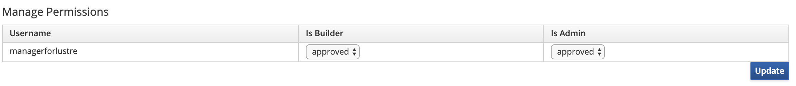

# Creating SRPM and RPM packages And Hosting on Copr

[**Software Contributor Documentation Table of Contents**](cd_TOC.md)

Many of our services and packages are packaged into rpm's, which are hosted on copr. Once on copr, the packages can be installed onto a system by simply adding the copr repo and using yum / dnf. This is an important step in the development process as it allows other developers to test new features and bug fixes in their own environment. This document aims to describe the process for building both an srpm as well as an rpm package and how to deploy it to copr. It will also show how to enable the repo and install it on any supported system.

## Prerequisites

Packaging software into an rpm requires a specfile, which describes how the software should be packaged. Creating a specfile is beyond the scope of this document, but you can find resources on how to do so at the following:

General documentation for spec files: [Spec Files](https://docs.fedoraproject.org/en-US/Fedora_Draft_Documentation/0.1/html/Packagers_Guide/sect-Packagers_Guide-Creating_a_Basic_Spec_File.html)

Creating spec files for rust projects: [Spec Files and Rust](https://whamcloud.github.io/Online-Help/docs/Contributor_Docs/cd_Building_Rust_RPMs.html)

**Important Note**: When working with spec files, make sure to wrap the Release attribute in a "# Release Start" and "# Release End" as shown below. This allows development builds to prepend an epoch to the release number.

For the purpose of this document, the following spec file will be used:

```bash
%define managerdir /iml-manager/

Name: iml-foo-component
Version: 0.1.0

# Release Start

Release: 1%{?dist}

# Release End

Summary: Foo component for IML

License: MIT
URL: https://github.com/whamcloud/integrated-manager-for-lustre/iml-foo-component
Source0: iml-foo-component.tar

%description
%{summary}.

%prep
%setup -q -n package

%build
#nothing to do

%install
rm -rf %{buildroot}

mkdir -p %{buildroot}%{\_datadir}%{managerdir}%{name}
cp package.js %{buildroot}%{\_datadir}%{managerdir}%{name}
cp package_bg.wasm %{buildroot}%{\_datadir}%{managerdir}%{name}

%clean
rm -rf %{buildroot}

%files
%attr(0644,root,root)%{\_datadir}%{managerdir}%{name}/package.js
%attr(0644,root,root)%{\_datadir}%{managerdir}%{name}/package_bg.wasm
```

Once a project is ready, it is time to create the project / package on copr. For the purpose of this document, we will use the following names:

**owner**: imldev

- The copr username. For production, this will be managerforlustre. For development, this will be your copr username.

**project**: iml-turbo-boost

- A group of features developed on multiple repos can be grouped into a project. For example, the action dropdown and locks updates require updates to iml-gui, iml-old-gui, iml-wasm-components, and python2-chroma-manager, which will all live in the iml-locks-testing project. The advantage of doing this is that you only need one copr repo to host a group of feature changes that span multiple git repositories.

**package**: iml-foo-component

- The git repository (iml-wasm-components, iml-gui, iml-old-gui, etc) containing feature changes. Multiple packages can live under a single project and such that you only need to add a single copr repo when testing.

Navigate to [copr.fedorainfracloud.org](https://copr.fedorainfracloud.org/) and create an account if you don't have one already. If you are doing development testing, the preferred method to setup a new project is to do the following:

1. Create a new project (iml-turbo-boost in this case) under the managerforlustre account
1. Under settings, provide both builder and admin privileges to your personal copr account (you can request privileges when you are logged in and navigate to the managerforlustre/iml-turbo-boost project)
   

1. Run the builder using the following settings (more on this below):

```
export OWNER=managerforlustre
export PROJECT=iml-turbo-boost
export PACKAGE=iml-foo-component
```

### Deploying to Copr (Development)

A docker container (referred to as "builder") can be found at https://hub.docker.com/r/imlteam/copr. It is used to build an SRPM given a spec file and once created, will upload to Copr, where the RPM will be generated and hosted in a git repository. To deploy a project to Copr using the builder, the following requirements must exist in the repo:

1. `<project-name>.spec`
1. .copr/Makefile

The Makefile acts as a script that knows how to bundle the project (via npm, cargo, etc). Here is a simple Makefile that will build the iml-foo-component:

```
srpm:
  dnf install -y openssl openssl-devel
  rm -rf /build/package
  rm -rf /tmp/\_topdir
  rm -rf /tmp/scratch
  mkdir -p /tmp/\_topdir/SOURCES
  mkdir -p /tmp/scratch
  cp -r ./\* /tmp/scratch
  cd /tmp/scratch; \
  wget https://static.rust-lang.org/rustup/dist/x86_64-unknown-linux-gnu/rustup-init; \
  chmod +x rustup-init; \
  ./rustup-init -y; \
  ~/.cargo/bin/rustup target add wasm32-unknown-unknown; \
  ~/.cargo/bin/cargo install wasm-bindgen-cli; \
  ~/.cargo/bin/cargo build --target wasm32-unknown-unknown --release; \
  mkdir -p package; \
  ~/.cargo/bin/wasm-bindgen target/wasm32-unknown-unknown/release/iml_action_dropdown.wasm --no-modules --out-dir ./package --out-name package; \
  tar cvf /tmp/\_topdir/SOURCES/iml-foo-component.tar package

  rpmbuild -bs --define "\_topdir /tmp/\_topdir" /tmp/scratch/iml-foo-component.spec

  cp -r /tmp/\_topdir/SRPMS/\* \$(outdir)
```

Once the spec file and Makefile are ready, deploying to copr is easy. This works for both stand-alone repos and workspaces that live inside of a parent repo (eg. iml-warp-drive lives under integrated-manager-for-lustre repo). Before you run the builder, you will need both the copr key and iv (if you don't have it you will need to ask for it). In a shell, navigate to the project folder (where the spec file lives) and run the following command:

```
export OWNER=managerforlustre
export PROJECT=iml-turbo-boost
export PACKAGE=iml-foo-component
export SPEC=iml-foo-component.spec
docker run -it -e OWNER="$OWNER" -e PROJECT="$PROJECT" -e PACKAGE="$PACKAGE" -e SPEC="$SPEC" -e KEY="<key>" -e IV="<iv>" -v \$(pwd):/build:rw imlteam/copr
```

This will run with output similar to the following:

```
867887 running. State: importing
867887 running. State: starting
867887 running. State: running
867887 running. State: running
867887 running. State: running
867887 running. State: succeeded
build 867887 succeeded
```

### Deploying to Copr (Production):

The process of deploying to copr for a production release is nearly identical to the steps above. The difference is that you will need to include the PROD environment variable and set it to true. This is also the time to ensure that the version and release values in the spec file are set appropriately as the builder will not modify these values when deploying for production. After verifying that these values are set correctly in the spec file, deploy the builder using the following command:

```
export OWNER=managerforlustre
export PROJECT=iml-turbo-boost
export PACKAGE=iml-foo-component
export SPEC=iml-foo-component.spec
export PROD=True
docker run -it -e OWNER="$OWNER" -e PROJECT="$PROJECT" -e PACKAGE="$PACKAGE" -e SPEC="$SPEC" -e PROD="$PROD" -e KEY="<key>" -e IV="<iv>" -v $(pwd):/build:rw imlteam/copr
```

### Creating RPM Locally

In case you do not want to host the RPM on copr, the builder is capable of creating the RPM locally in the working directory. The process to do this is similar to the steps above. The only difference is that you will need to include a LOCAL_ONLY environment variable.

```
export SPEC=iml-foo-component.spec
export LOCAL_ONLY=True
docker run -it -e SPEC="$SPEC" -e LOCAL_ONLY="$LOCAL_ONLY" -v $(pwd):/build:rw imlteam/copr
```

## Installing the Component from Copr

### Adding the Repo

Once the build succeeds, the repo needs to be added to the node where the component should be installed. SSH into the node and add the repo using:

```
yum install -y yum-plugin-copr
yum copr enable imldev/iml-turbo-boost
```

### Install the Package

Installing the package:

```
yum clean all
yum install iml-foo-component
```

## Manually Creating an SRPM (Not needed, information only)

Before Packaging, the code must first be compiled / built into its target. This is accomplished by running a Makefile and can be run inside of a docker container.

### Using a Docker Container to create the SRPM

1. Start a centos:centos7 docker container from the project's directory:
   ```
   docker run --privileged --name builder -dit -v "\$(pwd)":"/build":rw centos:centos7
   docker exec -it builder /bin/bash
   cd /build
   ```
1. Install any build dependencies
1. Run the makefile to generate the source rpm (srpm):
   ```
   make -f .copr/Makefile srpm outdir=/tmp/
   ```
1. Create the rpm from the srpm file (generated in the outdir):
   ```
   rpmbuild --rebuild <source_rpm_file>
   ```
1. The rpm will be generated under /root/rpmbuild/RPMS/x86_64. Copy the rpm file from this directory to the /build directory so that it can be accessed outside of the docker container.
