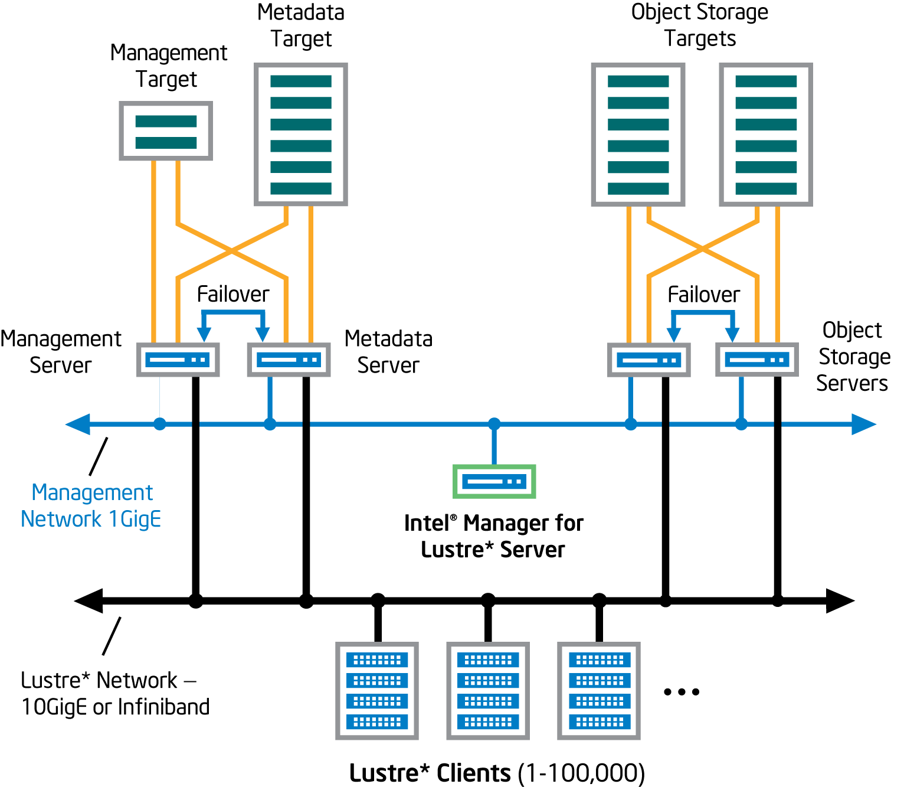
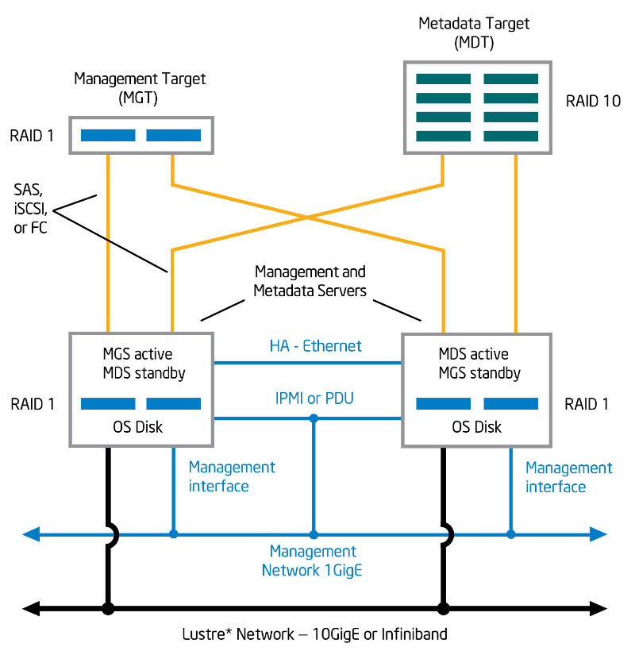
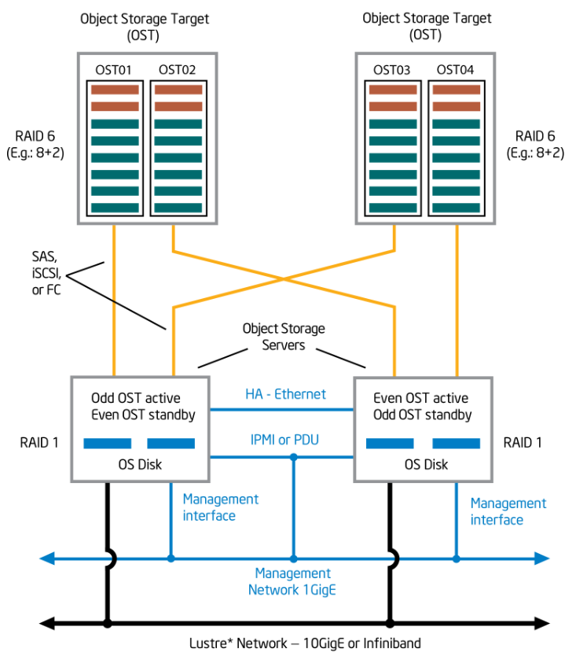

Intel® Enterprise Edition for Lustre\* Software\
Installation Guide

Partner Guide\
High Performance Data Division

Software Version: 3.1.0.3

World Wide Web:

http://www.intel.com

February 28, 2017

Disclaimer and legal information

Copyright 2017 Intel® Corporation. All Rights Reserved.

The source code contained or described herein and all documents related
to the source code ("Material") are owned by Intel® Corporation or its
suppliers or licensors. Title to the Material remains with Intel®
Corporation or its suppliers and licensors. The Material contains trade
secrets and proprietary and confidential information of Intel® or its
suppliers and licensors. The Material is protected by worldwide
copyright and trade secret laws and treaty provisions. No part of the
Material may be used, copied, reproduced, modified, published, uploaded,
posted, transmitted, distributed, or disclosed in any way without
Intel’s prior express written permission.

No license under any patent, copyright, trade secret or other
intellectual property right is granted to or conferred upon you by
disclosure or delivery of the Materials, either expressly, by
implication, inducement, estoppel or otherwise. Any license under such
intellectual property rights must be express and approved by Intel® in
writing.

INFORMATION IN THIS DOCUMENT IS PROVIDED IN CONNECTION WITH INTEL®
PRODUCTS. NO LICENSE, EXPRESS OR IMPLIED, BY ESTOPPEL OR OTHERWISE, TO
ANY INTELLECTUAL PROPERTY RIGHTS IS GRANTED BY THIS DOCUMENT. EXCEPT AS
PROVIDED IN INTEL'S TERMS AND CONDITIONS OF SALE FOR SUCH PRODUCTS,
INTEL® ASSUMES NO LIABILITY WHATSOEVER AND INTEL® DISCLAIMS ANY EXPRESS
OR IMPLIED WARRANTY, RELATING TO SALE AND/OR USE OF INTEL® PRODUCTS
INCLUDING LIABILITY OR WARRANTIES RELATING TO FITNESS FOR A PARTICULAR
PURPOSE, MERCHANTABILITY, OR INFRINGEMENT OF ANY PATENT, COPYRIGHT OR
OTHER INTELLECTUAL PROPERTY RIGHT.

A "Mission Critical Application" is any application in which failure of
the Intel® Product could result, directly or indirectly, in personal
injury or death. SHOULD YOU PURCHASE OR USE INTEL'S PRODUCTS FOR ANY
SUCH MISSION CRITICAL APPLICATION, YOU SHALL INDEMNIFY AND HOLD INTEL®
AND ITS SUBSIDIARIES, SUBCONTRACTORS AND AFFILIATES, AND THE DIRECTORS,
OFFICERS, AND EMPLOYEES OF EACH, HARMLESS AGAINST ALL CLAIMS COSTS,
DAMAGES, AND EXPENSES AND REASONABLE ATTORNEYS' FEES ARISING OUT OF,
DIRECTLY OR INDIRECTLY, ANY CLAIM OF PRODUCT LIABILITY, PERSONAL INJURY,
OR DEATH ARISING IN ANY WAY OUT OF SUCH MISSION CRITICAL APPLICATION,
WHETHER OR NOT INTEL® OR ITS SUBCONTRACTOR WAS NEGLIGENT IN THE DESIGN,
MANUFACTURE, OR WARNING OF THE INTEL® PRODUCT OR ANY OF ITS PARTS.

Intel® may make changes to specifications and product descriptions at
any time, without notice. Designers must not rely on the absence or
characteristics of any features or instructions marked "reserved" or
"undefined". Intel® reserves these for future definition and shall have
no responsibility whatsoever for conflicts or incompatibilities arising
from future changes to them. The information here is subject to change
without notice. Do not finalize a design with this information.

The products described in this document may contain design defects or
errors known as errata which may cause the product to deviate from
published specifications. Current characterized errata are available on
request.

Before using any third party software referenced herein, please refer to
the third party software provider’s website for more information,
including without limitation, information regarding the mitigation of
potential security vulnerabilities in the third party software.

Contact your local Intel® sales office or your distributor to obtain the
latest specifications and before placing your product order.\
\
Copies of documents which have an order number and are referenced in
this document, or other Intel® literature, may be obtained by calling
1-800-548-4725, or go to: http://www.intel.com/design/literature.htm.

Intel® and the Intel® logo are trademarks of Intel® Corporation in the
U.S. and/or other countries.

\* Other names and brands may be claimed as the property of others.

"This product includes software developed by the OpenSSL Project for use
in the OpenSSL Toolkit. (http://www.openssl.org/)

Contents {#contents .TOCHeading1}
========

[About this Document vii](#about-this-document)

[Document Purpose vii](#document-purpose)

[Intended Audience vii](#intended-audience)

[Conventions Used vii](#conventions-used)

[Related Documentation viii](#related-documentation)

[Introducing the Intel® Enterprise Edition for Lustre\* Software
1](#introducing-the-intel-enterprise-edition-for-lustre-software)

[What is Intel® Manager for Lustre\* Software?
1](#what-is-intel-manager-for-lustre-software)

[What is Management Mode? 1](#what-is-management-mode)

[What is Monitor-only Mode? 2](#what-is-monitor-only-mode)

[The Configuration Page in Monitor-only mode
2](#the-configuration-page-in-monitor-only-mode)

[Building a Lustre Storage Solution over a ZFS File System
2](#building-a-lustre-storage-solution-over-a-zfs-file-system)

[Building the System – The High Availability Configuration Spec
2](#building-the-system-the-high-availability-configuration-spec)

[Overall System Configuration 2](#overall-system-configuration)

[Manager Server Requirements 5](#manager-server-requirements)

[Management Server and Metadata Server Requirements
6](#management-server-and-metadata-server-requirements)

[Management Target 8](#management-target)

[Metadata Target 9](#metadata-target)

[Object Storage Server and Target Requirements
9](#object-storage-server-and-target-requirements)

[Power Control to Support Failover
12](#power-control-to-support-failover)

[Intelligent Platform Management Interface
12](#intelligent-platform-management-interface)

[Power Distribution Units 12](#power-distribution-units)

[Issues Regarding Power Loss to the BMC or PDU
13](#issues-regarding-power-loss-to-the-bmc-or-pdu)

[Pre-Installation Tasks 13](#pre-installation-tasks)

[What Not to Do 13](#what-not-to-do)

[LNET Configuration 13](#lnet-configuration)

[Server Configuration 14](#server-configuration)

[Client Requirements 16](#client-requirements)

[Linux\* Kernel Rebuilds and Patches
16](#linux-kernel-rebuilds-and-patches)

[Firewall Considerations 16](#firewall-considerations)

[Intel® EE for Lustre\* Software Installation
16](#intel-ee-for-lustre-software-installation)

[Installing Intel® EE for Lustre\* software
17](#installing-intel-ee-for-lustre-software)

[Intel® Manager for Lustre\* Software Configuration Settings
18](#intel-manager-for-lustre-software-configuration-settings)

[Editing Intel® Manager for Lustre\* Software Configuration Settings
20](#editing-intel-manager-for-lustre-software-configuration-settings)

[Creating a Managed Lustre File System
21](#creating-a-managed-lustre-file-system)

[Adding Storage Servers to a Lustre File System
21](#adding-storage-servers-to-a-lustre-file-system)

[Administering a Lustre File System
22](#administering-a-lustre-file-system)

[Configuring Clients 22](#configuring-clients)

[Client Requirements 22](#client-requirements-1)

[Installing Intel® EE for Lustre\* software on Clients Running RHEL or
CentOS
23](#installing-intel-ee-for-lustre-software-on-clients-running-rhel-or-centos)

[Installing Lustre on SUSE Linux Enterprise Server
25](#installing-lustre-on-suse-linux-enterprise-server)

[Installing and Configuring Lustre Manually
25](#installing-and-configuring-lustre-manually)

[Installing Intel® EE for Lustre\* software on Intel® Xeon Phi™
Coprocessors
26](#installing-intel-ee-for-lustre-software-on-intel-xeon-phi-coprocessors)

[Install Lustre\* client on an Intel® Xeon Phi™ Coprocessor
26](#install-lustre-client-on-an-intel-xeon-phi-coprocessor)

[Configure Lustre for the Intel® Xeon Phi™ Coprocessor
26](#configure-lustre-for-the-intel-xeon-phi-coprocessor)

[General Troubleshooting 27](#general-troubleshooting)

[Updating the Operating System 29](#updating-the-operating-system)

[Installing Updates to Intel® EE for Lustre\* software
29](#installing-updates-to-intel-ee-for-lustre-software)

[Appendix A - IPMI Checks 32](#appendix-a---ipmi-checks)

[IPMI Platform Check 32](#ipmi-platform-check)

[Appendix B - Backing up and Restoring Intel® Manager for Lustre\*
Server Software
33](#appendix-b---backing-up-and-restoring-intel-manager-for-lustre-server-software)

[Backup Overview 33](#backup-overview)

[Example Backup Checklist 35](#example-backup-checklist)

[Operating System 35](#operating-system)

[Host Name Resolution 36](#host-name-resolution)

[Package Update management environment (RPM & YUM)
37](#package-update-management-environment-rpm-yum)

[Identity configuration 37](#identity-configuration)

[Security configuration 37](#security-configuration)

[Intel® Manager for Lustre\* software
37](#intel-manager-for-lustre-software)

[Creating a Backup Manifest for the Intel® Manager for Lustre\* Server
38](#creating-a-backup-manifest-for-the-intel-manager-for-lustre-server)

[Network Configuration Files 38](#network-configuration-files)

[YUM Configuration 38](#yum-configuration)

[User Configuration 38](#user-configuration)

[SSH Host keys (Optional) 38](#ssh-host-keys-optional)

[SSH user keys (Optional) 39](#ssh-user-keys-optional)

[NTP Configuration 39](#ntp-configuration)

[Intel® Manager for Lustre\* SSL Certificates
39](#intel-manager-for-lustre-ssl-certificates)

[Intel® Manager for Lustre\* Database
40](#intel-manager-for-lustre-database)

[Restoring the Intel® Manager for Lustre\* Service
41](#restoring-the-intel-manager-for-lustre-service)

[Re-install OS and Restore System Configuration
41](#re-install-os-and-restore-system-configuration)

[Re-install Intel® Manager for Lustre\* software
42](#re-install-intel-manager-for-lustre-software)

[Restore the NTP Configuration 42](#restore-the-ntp-configuration)

[Restore the Intel® Manager for Lustre\* SSL certificates
42](#restore-the-intel-manager-for-lustre-ssl-certificates)

[Restore the PostgresSQL Database 42](#restore-the-postgressql-database)

[Restart Intel® Manager for Lustre\* software
43](#restart-intel-manager-for-lustre-software)

[Potential Issues 43](#potential-issues)

[Appendix C - Backup and Recovery of Servers Managed by Intel® Manager
for Lustre\* Software
45](#appendix-c---backup-and-recovery-of-servers-managed-by-intel-manager-for-lustre-software)

[Introduction 45](#introduction)

[Backup Overview 45](#backup-overview-1)

[Example Backup Checklist 47](#example-backup-checklist-1)

[Operating System 47](#operating-system-1)

[Host Name Resolution 49](#host-name-resolution-1)

[Package Update management environment (RPM & YUM)
49](#package-update-management-environment-rpm-yum-1)

[Identity configuration 49](#identity-configuration-1)

[Security configuration 49](#security-configuration-1)

[Creating a Backup Manifest for a Metadata Server or Object Storage
Server
49](#creating-a-backup-manifest-for-a-metadata-server-or-object-storage-server)

[Chroma Agent Configuration 49](#chroma-agent-configuration)

[Intel® Manager for Lustre\* YUM Repository Configuration
50](#intel-manager-for-lustre-yum-repository-configuration)

[Network Configuration 50](#network-configuration)

[SELinux Configuration 50](#selinux-configuration)

[Lustre LNET Configuration 50](#lustre-lnet-configuration)

[Pacemaker and Corosync High Availability Framework
50](#pacemaker-and-corosync-high-availability-framework)

[System Services Startup Scripts (rc.sysinit)
51](#system-services-startup-scripts-rc.sysinit)

[Sample Automated Backup Script for Intel® EE Lustre Servers
51](#sample-automated-backup-script-for-intel-ee-lustre-servers)

[Restoring a Server from Backup 52](#restoring-a-server-from-backup)

[Getting Help 56](#getting-help)

[Run chroma diagnostics 56](#run-chroma-diagnostics)

[Submit a ticket 57](#submit-a-ticket)

\
About this Document
===================

Document Purpose
----------------

This document provides detailed instructions for installing Intel®
Enterprise Edition for Lustre\* software. This document:

-   Introduces Intel® Enterprise Edition for Lustre\* software and its capabilities

-   Introduces Intel® Manager for Lustre\* software and its
     capabilities to configure and support real-time management of
     Lustre file systems, using a GUI-based dashboard

-   Provides detailed instructions about how to configure the components
     to create a file system that meets the High Availability
     Configuration Specification (discussed herein). Conformance with
     this specification permits configuration, monitoring, and
     management of the Lustre file system using the Intel® Manager for
     Lustre\* software.

-   Describes the pre-installation tasks such as configuring servers,
     establishing yum repositories, configuring LNET, and also
     discusses Linux\* kernel considerations

-   Describes how to install Intel® Enterprise Edition for Lustre\*
     software

-   Describes how to configure Intel® Manager for Lustre\* software

-   Describes how to add storage servers to the Lustre file system

-   Provides troubleshooting information

Intended Audience
-----------------

This guide is intended for partners who are designing storage solutions
based on Intel® Enterprise Edition for Lustre\* software. Readers are
assumed to be full-time Linux system administrators or equivalent who
have:

-   experience administering file systems and are familiar with storage
    components such as block storage, SAN, and LVM

-   Proficiency in setting up, administering and maintaining networks.
    Knowledge of LNET is required. Knowledge of InfiniBand\* is required
    if InfiniBand is to be used.

-   Detailed knowledge of the overall configuration of the storage
    system and the ability to verify that the configuration matches the
    configuration requirements as defined in this guide.

This document is *not intended for end users* of storage solutions
implemented using the Intel® Enterprise Edition for Lustre\* software.

Conventions Used
----------------

Conventions used in this document include:

-   \# preceding a command indicates the command is to be entered as
    root

-   \$ indicates a command is to be entered as a user

-   *&lt;variable\_name&gt;* indicates the placeholder text that appears
    between the angle brackets is to be replaced with an appropriate
    value

Related Documentation
---------------------

-   *Intel® Enterprise Edition for Lustre\* Software, Version 3.1.0.3
    Release Notes*

-   *Intel® Manager for Lustre\* Software Online Help* (accessible from
    within the GUI)

-   *Intel® Manager for Lustre\* Software User Guide* (a PDF verion on
    the online Help)

-   *Lustre\* Installation and Configuration using Intel® EE for
    Lustre\* Software and OpenZFS*

-   *Configuring LNet Routers for File Systems based on Intel® EE for
    Lustre\* Software*

-   *Installing Hadoop, the Hadoop Adapter for Intel® EE for Lustre\*,
    and the Job Scheduler Integration *

-   *Creating an HBase Cluster and Integrating Hive on an Intel® EE for
    Lustre® File System*

-   *Hierarchical Storage Management Configuration Guide*

-   *Configuring SELinux for File Systems based on Intel\* EE for
    Lustre\* Software*

-   *Configuring Snapshots for File Systems based on Intel® EE for
    Lustre\* Software*

-   *Upgrading a Lustre file system to Intel® Enterprise Edition for
    Lustre\* software (Lustre only)*

-   *Creating a Scalable File Service for Windows Networks using Intel®
    EE for Lustre\* Software*

-   *Intel® EE for Lustre\* Hierarchical Storage Management Framework
    White Paper*

-   *Architecting a High-Performance Storage System White Paper*

Introducing the Intel® Enterprise Edition for Lustre\* Software
=================================================================

Intel® Enterprise Edition for Lustre\* software, when integrated with
Linux, aggregates a range of storage hardware into a single Lustre\*
file system that is well proven for delivering fast IO to applications
across high-speed network fabrics, such as InfiniBand\* and Ethernet.

Lustre\* is a global, single-namespace file system architecture that
allows parallel access by many clients to all the data in the file
system across many servers and storage devices. Designed to take
advantage of the reliability features of enterprise-class storage
hardware, Intel® EE for Lustre\* software provides high availability
features including redundant servers with storage failover. Metadata and
data are stored on separate servers to allow each system to be optimized
for different workloads.

A high-availability Lustre file system managed by Intel® Manager for
Lustre\* software requires that your entire storage system configuration
and all interfaces comply with the High Availability Configuration
Specification presented in this guide.

If you are creating a Lustre file system that will use OpenZFS as the
backend, see the guide *Lustre\* Installation and Configuration using
Intel® EE for Lustre\* Software and OpenZFS*.

In addition to the specification presented next, please contact your
Intel® technical support representative for the latest information
regarding the configuration and interconnect requirements to achieve the
maximum benefits of an HA file system managed by Intel® EE for
Lustre\* software.

What is Intel® Manager for Lustre\* Software?
-----------------------------------------------

Intel® EE for Lustre\* software includes the Intel® Manager for
Lustre\* software, which greatly simplifies configuring, creating,
monitoring, and managing one or more Lustre file systems from either the
manager GUI, or the associated command line interface (CLI).

RestAPI plugins can further extend the functionality of IML. Such
plugins might include real-time storage monitoring that let you track
Lustre file system usage, performance metrics, events, and errors at the
Lustre level. Please contact Intel® for more information.

Intel® Manager for Lustre\* software is a part of the Intel® EE for
Lustre\* software product.

What is Management Mode?
------------------------

The Intel® Manager for Lustre\* software lets you create and manage
new high-availability (HA) Lustre file systems from its GUI. For each HA
file system, the GUI and dashboard let you create, monitor, and manage
all servers and their respective targets. The software lets you define
failover servers to support HA. RAID-based fault tolerance for storage
devices is implemented independent of Intel® Manager for Lustre\*
software. Software RAID (MDRAID) disk discovery is not supported.

To provide robust HA support, Intel® Manager for Lustre\* software
automatically configures Corosync and Pacemaker, and takes advantage of
IPMI or PDUs to support server failover. Note that Logical Volume
Manager (LVM) is not supported in [Management
mode](#what-is-management-mode), but is supported in [Monitor
mode](#what-is-monitor-only-mode).

**Note**: Managed HA support *requires* that your entire storage system
configuration and all interfaces be compliant with a *known
configuration*. See the [High Availability Configuration
Specification](#building-the-system-the-high-availability-configuration-spec)
herein for more information.

What is Monitor-only Mode?
--------------------------

Monitor-only mode allows you to “discover” a working Lustre file system.
Using Intel® Manager for Lustre\* software, you can then monitor the
file system at the Intel® Manager for Lustre\* dashboard. All of the
charts presented on the manager dashboard to monitor performance and
statistics, are also available in monitor-only mode.

Monitor-only mode is for file systems that do not fully conform to the
High Availability Configuration Specification. In this situation, the
Corosync and Pacemaker configuration modules provided with Intel®
Manager for Lustre\* software are not automatically deployed. This means
that Intel® Manager for Lustre\* software cannot configure the file
system for server failover. Note that Logical Volume Manager (LVM) is
not supported in [Management mode](#what-is-management-mode), but is
supported in [Monitor mode](#what-is-monitor-only-mode).

### The Configuration Page in Monitor-only mode

The Configuration page presented by Intel® Manager for Lustre\*
software is designed primarily to enable designers to create Lustre file
systems with server failover capability, but this capability is not
supported in monitor-only mode. However, many of the features provided
on the Configuration page are also directly useful for monitor-only file
systems.

Building a Lustre Storage Solution over a ZFS File System
---------------------------------------------------------

If your intent is to build a high-availability, Lustre storage solution
over an existing ZFS, Intel® EE for Lustre\* software supports this
configuration. However, the installation and configuration of such a
system is not described in this guide. Please see the document:
*Lustre\* Installation and Configuration using Intel® EE for Lustre\*
Software and OpenZFS*.

Building the System – The High Availability Configuration Spec
==============================================================

A high-availability Lustre file system managed by Intel® Manager for
Lustre\* software requires that your entire storage system configuration
and all interfaces comply with the High Availability Configuration
Specification presented in this chapter.

If you are creating a Lustre file system that will use OpenZFS as the
backend, see the guide *Lustre\* Installation and Configuration using
Intel® EE for Lustre\* Software and OpenZFS*.

In addition to the specification presented next, please contact your
Intel® technical support representative for the latest information
regarding the configuration and interconnect requirements to achieve the
maximum benefits of an HA file system managed by Intel® EE for
Lustre\* software.

Overall System Configuration
----------------------------

The high-level configuration of an HA file system managed by Intel® EE
for Lustre\* software consists of the following. See Figure 1.

-   A **dedicated manager server** hosts the Intel® Manager for Lustre\*
    software and dashboard.

-   **Management server** (MGS): The MGS provides access to the
    management target (MGT) storage. To support failover, the management
    server is also configured as the backup for the metadata server.

-   **Metadata server** (MDS): The MDS provides access to the metadata
    target storage. To support failover, the metadata server is also
    configured as the backup management server.

-   **Object storage server** (OSS): At least two servers provide access
    to the object storage targets, which store the file system’s data.
    OSSs are configured in failover pairs sharing access to the same
    data storage, so that if an OSS fails, service is automatically
    failed over to its peer server.

-   **Management target** (MGT): The MGT stores configuration
    information for all the Lustre file systems in a cluster and
    provides this information to other Lustre components. The MGT is
    accessed by the primary MGS and, if the MGS fails, by the MDS
    operating in failover mode. The MGT should *not* be larger than 10
    Gbyte in capacity.

-   **Metadata target** (MDT): The MDT stores metadata (such as file
    names, directories, permissions, and file layout) for attached
    storage and makes them available to clients. The MDT is accessed by
    the primary MDS and, if the MDS fails, by the MGS operating in
    failover mode.

-   **Object storage targets** (OSTs): Client file system data is stored
    in one or more objects that are located on separate OSTs. The number
    of objects per file is configurable by the user and can be tuned to
    optimize performance for a given workload. RAID 6 is recommended for
    OSTs. RAID is implemented independent of Intel® Manager for
    Lustre\* software. Note that Logical Volume Manager (LVM) *is not*
    supported in [Management mode](#what-is-management-mode), but *is*
    supported in [Monitor mode](#what-is-monitor-only-mode). Software
    RAID (MDRAID) disk discovery is not supported.

-   **Failover/High Availability ring 1 network**: This network supports
    Pacemaker and Corosync and requires an IP address block within the
    10/8 RFC-1918 private IP address space. Should you choose to utilize
    the 10/8 address block for the management/ring0 network as well,
    then the largest permissible network size that may be used for the
    management network (ring0) is /9, since the High Availability ring1
    network must co-exist within the 10/8 address space as well.
    Additionally, because the 10/8 network is used for the High
    Availability ring1 network and it must be of equal size to the
    management/ring0 network, the largest management/ring0 network you
    can define is a /9. Sizes larger than /9 are unsupported. Given
    those restrictions, if you require a /8 address block for your
    management network, you will be unable to utilize the RFC 1918
    private IP addressing space (i.e. 10/8) and must choose another /8
    network.

-   **Management network**: The Management network is 1-gigabit
    Ethernet, connecting every server in the file system. This network
    is used with ssh, to install and update Intel® Manager for
    Lustre\* software on each server. It is also used to manage the
    servers and make separate connections to an IPMI port installed on
    each managed server.

-   **Lustre network**: Generally, the Lustre network (LNET) is either
    10-gigabit Ethernet or Infiniband and provides high-speed file
    system access for each client. The required data rate of this
    network is generally driven by the file system size, the number of
    clients, and the average throughput requirements for each client.

**Note**: After you have completely configured the system and installed
Intel® EE for Lustre\* software on the manager server, you will be
ready to create the Lustre file system using the Intel® Manager for
Lustre\* software. **Note that installation consists of installing
Intel® EE for Lustre\* software on the manager server only**. For HA
file systems, the software automatically installs required packages on
the file system’s servers to support HA. This avoids the need to
manually install the Intel® EE for Lustre\* software on storage
servers and avoids possible errors.

During this physical configuration of your file system hardware, be sure
to write down how servers and storage are configured so you can later
assign primary and failover servers to each volume (using the Intel®
Manager for Lustre\* software GUI). Also, keep records of how failover
power control has been implemented (IPMI or PDUs) as this will be needed
later.

Figure 1 shows the high-level HA system configuration.

{width="5.976068460192476in"
height="5.201466535433071in"}

[]{#_Ref440028836 .anchor}Figure . Lustre\* High-Availability File
System Configuration

**\
Note**: All references herein to the *manager GUI* refer to the Intel®
Manager for Lustre\* graphical user interface.

Manager Server Requirements
---------------------------

The *manager server* is a dedicated server on which the Intel® Manager
for Lustre\* software is installed. This is unique from the *management*
*server*. Requirements for the manager server are listed next.

**Note**: Before using the Red Hat or RHEL software referenced herein,
please refer to Red Hat’s website for more information, including
without limitation, information regarding the mitigation of potential
security vulnerabilities in the Red Hat software.

-   X86 CPU

-   At *least* 4 GB of RAM

-   Storage on the server large enough to accommodate:

    -   24 GB for the operating system and additional packages

    -   Swap space equal to twice the available RAM present

    -   a base OS installation that provides **at least a 500-GB /var
        partition**

-   A one gigabit Ethernet port to connect to the management network.

-   RAID 1 is a minimum recommendation. RAID 10 may be optimal for heavy
    workloads. Software RAID (MDRAID) disk discovery is not supported.

-   Red Hat Enterprise Linux or CentOS Linux, version 7.3 must be
    installed on all servers. All Lustre servers should be running the
    same OS and version. CentOS must have access to the base
    repositories and update repositories. Red Hat must have the
    following channels registered and enabled:

    -   rhel-x86\_64-server-supplementary-7

    -   rhel-x86\_64-server-optional-7

    -   rhel-x86\_64-server-ha-7

    -   rhel-x86\_64-server-7

-   yum needs to be functional (with any needed proxies) and default yum
    repositories must be fully configured. Run yum update to verify that
    yum updates occur successfully.

 Intel® Manager for Lustre\* software is supported on:

-   Latest released Google Chrome browser.

-   Latest released Mozilla Foundation Firefox browser.

Management Server and Metadata Server Requirements
--------------------------------------------------

The management server (MGS) is configured as a failover server with the
metadata server (MDS), and vice-versa, so the MGS and MDS share the same
configuration requirements.

**Note**: The MGS is separate from the independent server running Intel®
Manager for Lustre\* software.

Figure 2 depicts the configuration, interconnect requirements and
targets for the MGS and MDS.

{width="5.828125546806649in"
height="5.980930664916885in"}

[]{#_Ref455643078 .anchor}Figure . Management and Metadata Server and
Target Configuration

The MDS and MGS, both independent servers, share the following
requirements.

-   X86 CPU

-   MDS and MGS memory requirements are determined by factors such as
    the number of clients, the sizes of directories, and the load placed
    on the server. See the *Lustre\* 2.X File System Operations Manual,
    Chapter 5, Determining Hardware Configuration Requirements and
    Formatting Options* for more information.

-   Red Hat Enterprise Linux or CentOS Linux version 7.3 must be
    installed. All Lustre servers should be running the same OS and
    version. CentOS must have access to the base repositories and update
    repositories. Red Hat must have the following channels registered
    and enabled:

    -   rhel-x86\_64-server-supplementary-7

    -   rhel-x86\_64-server-optional-7

    -   rhel-x86\_64-server-ha-7

    -   rhel-x86\_64-server-7

-   A dedicated Ethernet port capable of one gigabit/sec. This port
    connects to the Management network.


-   yum needs to be functional, with any needed proxies, and default yum
    repositories must be fully configured. Run yum update to verify that
    yum updates occur successfully.


-   HA servers are configured in pairs, with a primary server and a
    failover server.

-   Crossover cable – Each HA server (excluding the manager server) is
    connected to its peer HA server by a private crossover link. This is
    an Ethernet connection.

-   All required multipath configuration between each storage server
    controller and its physical storage devices must be complete.

-   Storage controllers and drives must already be installed and LUNs
    must already be configured and present.

-   Each server of a failover pair must have access to exactly the same
    LUNs as its peer. Each LUN is visible only to its two, paired
    failover servers.


-   For proper failover functionality, paired servers must be able to
    access the other’s power control device. This can be implemented
    either using power distribution units (PDUs) or IPMI. Recommended
    PDUs are from American Power Conversion Corp., models AP7900,
    AP7901, AP7902, AP7920, AP7921, AP7930, AP7931, AP7932, AP7960,
    AP7990, and AP8941. Each server should be supplied with two power
    supply sources, for redundancy.

Management Target
-----------------

-   For comparatively small file systems, the typical management target
    capacity might be 100 MB. See the *Lustre\* 2.X File System
    Operations Manual, Chapter 5, Setting up a Lustre File System* for
    more information.

-   Intel® Manager for Lustre\* software does *not* support an MGT
    larger than 10 Gbytes.

-   RAID 1 is recommended. Software RAID (MDRAID) disk discovery is not
    supported.

-   As described above, the MGS and MDS servers are connected to the
    management storage in a primary/failover configuration.

-   All required multipath configuration between each storage server
    controller and its physical storage devices must be complete.

Metadata Target
---------------

-   Storage capacity for the metadata target should be 2K bytes per
    storage system file. Multiply the anticipated number of files the
    file system will contain by 2K to determine the required capacity of
    the target. See the *Lustre\* 2.X File System Operations Manual,
    Chapter 5, Setting up a Lustre File System* for more information.

-   RAID 10 is recommended for metadata targets. Software RAID (MDRAID)
    disk discovery is not supported.

-   As described above, the MGS and MDS servers are connected to
    metadata storage in a primary/failover configuration.

-   All required multipath configuration between each storage server
    controller and its physical storage devices must be complete.

Object Storage Server and Target Requirements
---------------------------------------------

The object storage server (OSS) provides access to the object storage target(s) (OST). There is no specific limit to the number of OSSs. For HA, each OSS must have a failover twin. This means that OSSs are paired. Each OSS pair can provide access for to up to 8 targets or LUNS. The maximum capacity for an OST is 128 terabytes. Figure 3 depicts the configuration and interconnect requirements for HA OSSs and OSTs. See the *Lustre\* 2.X File System Operations Manual, Chapter 5, Setting up a Lustre File System* for more information.

{width="6.1875in"
height="7.087858705161855in"}

Figure . Object Storage Server(s) and Target(s) Configuration

Requirements for HA object storage servers and targets are as follows:

-   Red Hat Enterprise Linux or CentOS Linux version 7.3 must be
    installed. All Lustre servers should be running the same OS and
    version. CentOS must have access to the base repositories and update
    repositories. Red Hat must have the following channels registered
    and enabled:

    -   rhel-x86\_64-server-supplementary-7

    -   rhel-x86\_64-server-optional-7

    -   rhel-x86\_64-server-ha-7

    -   rhel-x86\_64-server-7

-   A storage device of at least 6 GB on each server to store the
    operating system and additional packages. Generally, OSS and OST
    space requirements are driven by the total size of the file system,
    the number of servers and OST, the number of files in the file
    system and the file size. See the Lustre\* 2.X File System
    Operations Manual, Chapter 5, Setting up a Lustre File System for
    more information.

-   A dedicated Ethernet port capable of one gigabit/sec. This port
    connects to the Management network.

-   yum needs to be functional, with any needed proxies, and default yum
    repositories must be fully configured. Run yum update to verify that
    yum updates occur successfully.

-   HA servers are configured in pairs, with a primary server and a
    failover server.

-   Crossover cable – Each HA server (excluding the manager server) is
    connected to its peer HA server by a private crossover link. This is
    an Ethernet connection.

-   Any required multipath configuration between each storage server
    controller and its physical storage devices must be complete.

-   Storage controllers and drives must already be installed and LUNs
    must already be configured and present.

-   Each server of a failover pair must have access to exactly the same
    LUNs as its peer. Each LUN is visible only to its two, paired
    failover servers.

-   For proper failover functionality, paired servers must be able to
    access the other’s power control device. This can be implemented
    using power distribution units (PDUs) or by using IPMI. Recommended
    PDUs are from American Power Conversion Corp., models AP7900,
    AP7901, AP7902, AP7920, AP7921, AP7930, AP7931, AP7932, AP7960, and
    AP7990. Each server should be supplied with two power supply
    sources, for redundancy.

-   RAID 6, n+2 is recommended for object storage targets. For optimal
    write performance, n should be a power of 2 (e.g. 4, 8, or 16). This
    helps to ensure that a full stripe write of 1 MB can be spread
    evenly across all disks in the volume, with no “read, modify, write”
    penalty. Note that Logical Volume Manager (LVM) is not supported in
    [Management mode](#what-is-management-mode), but is supported in
    [Monitor mode](#what-is-monitor-only-mode). Software RAID (MDRAID)
    disk discovery is not supported.

-   There is no specific limit to the number of object storage servers,
    but each OSS should support no more than eight target storage
    devices.

Power Control to Support Failover
---------------------------------

High availability requires the ability to shut down a failing server so
that it will not interfere with file system operations, allowing the
backup (failover) server to assume its role. This control can be
provided by using power distribution units (PDUs) or IPMI. To comply
with this High Availability Configuration Specification, you must use
either PDU control or IPMI, but not both.

### Intelligent Platform Management Interface

High availability requires that you configure IPMI *or* power
distribution units to support failover. The Intelligent Platform
Management Interface (IPMI) enables server failover support. For this
configuration, each managed server requires an IPMI controller that
connects directly to the management network via a dedicated Ethernet
port. A failing HA server is automatically power-cycled and access to
its target storage devices is provided by the backup server.
Power-cycling the failed server forces it to relinquish control of its
resources and allows administrators to troubleshoot it.

After the failed server is repaired and ready for return-to-service, it
is *not* automatically brought back online as the primary server
(failed-back). Fail-back is performed manually, by the administrator at
the Intel® Manager for Lustre\* software GUI.

**Note**: See [Issues Regarding Power Loss to the BMC or
PDU](#issues-regarding-power-loss-to-the-bmc-or-pdu)

After you have connected and configured IPMI, see [Appendix A, IPMI
Checks](#_Appendix_A_-).

### Power Distribution Units

High availability requires that you configure IPMI *or* power
distribution units to support failover. Power distribution units (PDUs)
can be used to give control over the power supplied to a HA server to
its peer server. If one server of an HA pair detects the failure of its
peer server, the detecting server turns off power to the PDU outlets
connected to the failing server. If you chose to use PDUs for power
control, be sure to note which PDUs and outlets are connected to which
servers. Also, for redundancy, be sure that the primary and backup power
outlets connected to each server reside on different PDUs. After
configuring PDUs and noting PDU/server assignments, you will later
configure these assignments on the Intel® Manager for Lustre\* Power
Control tab.

**Note**: See [Issues Regarding Power Loss to the BMC or
PDU](#issues-regarding-power-loss-to-the-bmc-or-pdu)

### Issues Regarding Power Loss to the BMC or PDU

Regarding failover, if the method of power control is not functioning
(e.g., loss of power to the fencing device, misconfiguration, etc.), HA
will be unable to fail the targets from the failed server to its
failover server. This is because in order to complete failover, the
failover server must be able to guarantee that the failed server can no
longer access targets running on it. The only way to be sure this is
true is to remove power from the failed server. Thus, the failover
server must be able to communicate with the fencing device of the failed
server for failover to occur successfully.

With IPMI, the power for each HA server and its fencing device is
coupled together. Accordingly, there are more scenarios where both may
lose power at once (chassis power failure, motherboard failure, etc.).
If a server suffers chassis power failure such that the BMC is not
operational, HA will be unable to fail the targets over. The remedy in
this situation is to restore power to the chassis of the failed server
to restore the functionality of your file system. If HA coverage for the
scenarios just described is important to you, we strongly recommend
using smart PDUs, rather than IPMI as your fencing device.

Power loss to a PDU will mean that HA will be unable to fail the targets
over. As in the above situation, the remedy is to restore power to the
PDU to restore the functionality of your file system. We recommend
redundant PDUs if availability is critical.

Pre-Installation Tasks
======================

What Not to Do
--------------

Please do *not* perform the following tasks, as these tasks (among
others) are performed automatically, or will conflict with the software:

-   Do **not** configure IP addresses for the crossover cable interfaces
    (server to target).

-   Do **not** install or configure Lustre, Corosync, or Pacemaker.
    Install Intel® EE for Lustre\* software only as described in this
    guide.

-   Do **not** configure NTP on storage servers.

-   When installing Red Hat Enterprise Linux or CentOS Linux, do **not**
    use the EPEL repositories. Uninstall EPEL-release on all systems if
    it is installed.

-   Do **not** install CMAN (Cluster Manager) or other packages that use
    the Red Hat fence agents. Intel® Manager for Lustre\* software will
    have package conflicts. Remove all such packages from all systems.

LNET Configuration
------------------

LNET provides the client network infrastructure required by the Lustre
file system. It supports many commonly used network types such as
InfiniBand and Ethernet.

Basic LNET configuration can be performed using the Intel® Manager for
Lustre\* GUI. This is done before creating the Lustre file system. In
this early version of GUI-based LNET configuration, it is intended that
the file system will exist on a *single* LNET and that all servers and
clients are on this LNET. In this case, you can perform LNET
configuration from the GUI and the configuration information is saved in
a reserved file called
/etc/modprobe.d/iml\_lnet\_module\_parameters.conf. Do not manually edit
this file. Simply follow the instructions in the Intel® Manager for
Lustre\* Help.

If you wish to configure more advanced features (such as routes and IP
networks), then you should do this manually, in a separate file
contained in the /etc/modprobe.d directory. Please see the configuration
guide *Configuring LNet Routers for File Systems based on Intel® EE for
Lustre\* Software* and also see the *Lustre Operations Manual, Chapter 9
- Configuring Lustre Networking*:
[https://build.hpdd.intel.com/job/lustre-manual/lastSuccessfulBuild/artifact/lustre\_manual.xhtml\#configuringlnet](https://build.hpdd.intel.com/job/lustre-manual/lastSuccessfulBuild/artifact/lustre_manual.xhtml%23configuringlnet)

Server Configuration
--------------------

The following are pre-installation configuration requirements for
servers. These requirements apply to ALL servers unless specifically
noted.

**Note**: If you are installing Lustre on servers that have been
previously configured as ZFS file system servers, first re-provision all
servers with the correct, supported operating system. Then install
Lustre as described herein. *Any existing file system data will be
lost*.

1.  Red Hat Enterprise Linux or CentOS Linux version 7.3 must be
    installed. All servers should be running the same OS and version.

    -   **Do not** use the EPEL repositories. Uninstall EPEL-release on all
    systems if it is installed.

    -   Do **not** install CMAN (Cluster Manager) or other packages that use
    the Red Hat fence agents. Intel® Manager for Lustre\* software will
    have package conflicts. Remove all such packages from all systems.

1.  For servers running Red Hat Linux, each server must be registered
    with RHN (Red Hat Network) and have the optional channel installed.
    Following is one example of how to accomplish this. Please reference
    your site instructions for more information.

    ```
subscription-manager register --autosubscribe\
--username=\$redhat\_register\_user\
--password=\$redhat\_register\_password
 yum -y install yum-utils
yum-config-manager --enable rhel-7-server-optional-rpms
```


1.  Next, you will need to configure hostname resolution of all Lustre
    nodes, on each Lustre node. Dynamic hostname resolution (DNS) can be
    used to perform this step. If DNS is not being used, you can perform
    this manually as follows:

    a. Set useful hostnames and ensure you have a functioning /etc/hosts
    file. Give each server a unique name, such as manager, mds1, mds2,
    oss1 and oss2. You should be able to “ping &lt;hostname&gt;” and ssh
    freely between systems (dependent on a functional /etc/hosts file).
    b. An /etc/hosts file might have something like this in it when
    complete:


    ```
"
10.0.0.101 manager
10.0.0.102 ost1
10.0.0.103 mds1
10.0.0.104 mds2
10.0.0.105 ost2
 "
```
1. Copy your /etc/hosts file to all servers.

1.  Use ssh-copy-id to copy your ssh public key to each server so that
    your servers are able to ssh into each other without having to enter
    a password.

2.  Yum needs to be functional, with any needed proxies, and default yum
    repositories must be fully configured. Run yum update to verify that
    yum updates occur successfully. “yum search vim” will reveal if you
    cannot connect to your configured repositories.

3.  Ensure that NTP is not running on any system. Intel® EE for Lustre\*
    software will manage NTP.

4.  Ensure that ssh root access “ssh -l root &lt;hostname&gt;” works
    from the server that will be hosting the Intel® Manager for Lustre\*
    dashboard, to all other file system servers.

5.  Properly configure the firewall to allow access to your
    distribution’s yum repositories and any external NTP service. You
    should also be able to ssh between the Lustre servers and the
    manager server without having to enter a password.

[]{#_LNET_Configuration .anchor}**Note**: If a storage node (a Lustre
server) is to be used as a metadata server (MDS), to properly enforce
Lustre file permissions, the MDS *must have access* to the same UID/GID
database as the Lustre clients. For example, if the Lustre clients are
using LDAP to provide network-wide user account information, the MDS
must be configured to check LDAP for user account information. If a pair
of nodes has been configured as HA peers for an MDT, LDAP must be
configured on both nodes to ensure proper functionality in the event of
a failover.

**Note**: Non-root users should be prevented from logging into storage
nodes.

Client Requirements
-------------------

A client accessing your Lustre file system (created with Intel® Manager
for Lustre\* software) must be running Intel® EE for Lustre\* 3.1.0.3
client software. See [Configuring Clients](#configuring-clients) for
instructions on installing software and configuring clients.

LNET provides the client network infrastructure required by the Lustre
file system and LNET must be configured for each client. See [LNET
Configuration](#_LNET_Configuration).

Linux\* Kernel Rebuilds and Patches
-----------------------------------

The installation of Intel® EE for Lustre\* software will replace your
existing Linux\* kernel on all servers. If you require other kernel
patches for your environment please contact Intel® for further
assistance with this issue. For those who may need to rebuild a kernel,
first contact Intel® support as rebuilding will over-write the kernel
installed with Intel® EE for Lustre\* software.

Firewall Considerations
-----------------------

[]{#_Toc402946281 .anchor}Intel® Manager for Lustre\* software runs on
servers running RHEL or CentOS, version 7.3. The *firewalld* package
needs to be installed and configured for *all file system servers
before* installing Intel® EE for Lustre\* software. The Intel® EE for
Lustre\* software installation process will then modify the firewall
configuration as needed for Intel® EE for Lustre\* software to operate.

Intel® EE for Lustre\* Software Installation
==============================================

This section describes how to install the Intel® EE for Lustre\*
software and the Intel® Manager for Lustre\* software on the *manager
server.*

After Intel® EE for Lustre\* and Intel® Manager for Lustre\* software is
installed, point your web browser to the Intel® Manager for Lustre\*
dashboard. Use Chrome\* or Firefox\*. A display monitor with a minimum
resolution of 1024 X 768 pixels is recommended, to adequately display
the Intel® Manager for Lustre\* software GUI.

**Note**: Later, when adding storage servers to your Lustre file system,
the Intel® Manager for Lustre\* agent, Intel® EE for Lustre\*
software, and specific dependencies (e.g.: for Corosync and Pacemaker)
are automatically deployed to the storage server. This avoids the need
to manually install the Intel® EE for Lustre\* software on storage
servers and avoids possible errors.

**Note**: Some installations may opt to deploy and configure a Lustre
file system manually, without Intel® Manager for Lustre\* software.
Other installations may opt to deploy and configure a Lustre file system
and then later install Intel® Manager for Lustre\* software to be used
in Monitor-only mode. The overall release tarball is ee-3.1.0.3.tar.gz.
To deploy and configure Lustre manually, see [Installing and Configuring
Lustre Manually](#installing-and-configuring-lustre-manually).

For information regarding installing and configuring Lustre, see Part II
of the *Lustre Operations Manual*. This information is available at the
following URL. If this page does not load, copy and paste it into your
browser.

<https://build.hpdd.intel.com/job/lustre-manual/lastSuccessfulBuild/artifact/lustre_manual.xhtml#part.installconfig>

Installing Intel® EE for Lustre\* software
--------------------------------------------

You will need the following information to perform this installation:

-   The name, email address, and password you wish to use for the first
    Intel® Manager for Lustre\* software superuser. The email address
    must use an FQDN.

-   (Optional) The fully qualified domain name (FQDN) of the NTP server
    (internal or external) used for your site. If no NTP server is set,
    the Intel® Manager for Lustre\* server's clock will act as the
    time source for the entire storage cluster.

To install the software, complete these steps:

1.  Download the installation archive to a directory on the manager
    server (e.g. /tmp).

2.  Unpack the installation archive using tar: ee-3.1.0.3.tar.gz:

    ```
# cd /tmp; mkdir install
# tar –C install –xzf ee-3.1.0.3.tar.gz
```


1.  To install the Intel® EE for Lustre\* software, run:

    ```
# cd /tmp/install/ ee-3.1.0.3
# ./install
```


1.  []{#_Ref336418703 .anchor}When the prompts below appear, enter your
    parameters for the first superuser of Intel® Manager for Lustre\*:

    **Username:** *&lt;Enter the name of the superuser&gt;*

    **Password:** *&lt;Enter a password&gt;*
    
    **Confirm password:** *&lt;Enter the password again&gt;*

    **Email:** *&lt;Enter an email address for the superuser&gt;*

    


    **Note**: Additional Intel® Manager for Lustre\* software superusers as well as file system administrators and users can be created in the manager GUI.

When configuration is complete, a message is displayed indicating the installation was successful.

1.  When the prompt **NTP Server \[localhost\]** appears, respond with
    **one of these options**:

    -   *Option 1:* To designate the NTP server (internal or external) used
    for your site, enter the FQDN or IP address of the NTP server and
    press the **&lt;Enter&gt;** key.

    -   *Option 2:* To use the Intel® Manager for Lustre\* software
    server’s clock as the time source, press the **&lt;Enter&gt;** key.

1.  Using ifconfig, obtain the IP address of the administrative network
    interface for the server hosting Intel® Manager for Lustre\*
    software. The default network interface for Intel® Manager for
    Lustre\* software is eth0.

2.  Open a web browser and access the Intel® Manager for Lustre\*
    software GUI using the server IP address obtained in the previous
    step. Enter in the address field of your browser:
    
    ```
https://<command_center_server_IP_address>/
```

    **Note**: If the IP address of the server has an associated FQDN, you can connect to the Intel® Manager for Lustre\* GUI user interface using:

```
    https://<command_center_server_fqdn>/
```


**Note**: The GUI uses a self-signed SSL certificate to secure
communications between the browser and the server. You will need to
accept this certificate in order to connect to the Intel® Manager for
Lustre\* GUI. A certificate can be downloaded from (example only):\
https://&lt;manager-addr&gt;/certificate/

After Intel® EE for Lustre\* software is installed, point your web
browser to the Intel® Manager for Lustre\* dashboard. Use Chrome\* or
Firefox\*.

Intel® Manager for Lustre\* Software Configuration Settings
-------------------------------------------------------------

The following Intel® Manager for Lustre\* software configuration
settings can be modified. See the instructions for modifying these
settings following the descriptions.


**```
ALLOW\_ANONYMOUS\_READ
```**


**Default**: True (Uppercase first letter required.)

**Description**: Allows anonymous (unauthenticated) users to view
statistics, logs and status of a system in the Intel® Manager for
Lustre\* GUI but not to make any changes. If set to False, anonymous
users will be presented with a login prompt and no data.


**```
DISABLE\_POWER\_CONTROL\_DEVICE\_MONITORING
```**


**Default**: False (Uppercase first letter required.)

**Description**: The default state is False, allowing automatic
monitoring of power control devices. When set to True, this setting
disables the manager software’s monitoring of your power control devices
(eg, BMC, PDU outlets, etc.) This is necessary for sites where the
manager server does not have access to the power control devices itself.
However, Intel® Manager for Lustre\* software will then NO LONGER REPORT
ANY FAILURE IN ANY POWER CONTROL DEVICES. If power control becomes
non-operational, automatic failover will not occur on failure, and
manual intervention will be required to restore service to your file
system. If you chose to make this setting to True, we recommend
implementing an alternate mechanism to monitor of power control devices,
outside of Intel® Manager for Lustre\* software.

|Setting|Default|Description|
|---|---|---|
|**```EMAIL\_HOST```**|None|SMTP server hostname (Example: 'server1.test.com')|
|**```EMAIL\_PORT```**|25|SMTP server port number.|
|**```EMAIL\_HOST\_USER```**|' '|SMTP server username (or ' ').|
|**```EMAIL\_HOST\_PASSWORD```**|' '|SMTP server username (or ' ').|
|**```EMAIL\_USE\_TLS```**|False (Uppercase first letter required.)|True indicates that TLS/SSL is to be used. False indicates it is not to be used.|
|**```EMAIL\_SENDER```**|'noreply\@\<command_center server_fqdn>'|The address that appears in the *From* field on alert emails.

### Editing Intel® Manager for Lustre\* Software Configuration Settings

To change these configuration settings:

1.  Use a text editor to create or modify a file ```
local_settings.py
```
 in the directory ```
 /usr/share/chroma-manager/
```

    For example, add the following setting to the ```local_settings.py```
 file to restrict view of system statistics, logs, and status to only users who are logged in:
```
ALLOW_ANONYMOUS_READ=False
```
In this example, the first letter of False must be capitalized.

    **Note**: Entries must follow Python\* syntax rules. For example, all strings must be enclosed in single or double quotes (double quotes must be used if the string includes a single quote). For example, EMAIL\_HOST=server1.test.com will result in an error, while EMAIL\_HOST='server1.test.com' is a valid entry.

    **Warning**: If you edit the file settings.py instead of creating a local\_settings.py file, your changes will be overwritten without warning when the Intel® Manager for Lustre\* software is updated.

1.  To configure email alerts, complete one of the options below. By
    default, email alerts from the Intel® Manager for Lustre\*
    software are disabled (EMAIL\_HOST set to None).

    -   *Option 1: Set up an external mail server.* Create or modify the
    file\
    /usr/share/chroma-manager/local\_settings.py to provide appropriate
    values for these settings:

        a.  Set EMAIL\_SENDER to an address suitable for your site.

        b.  []{#Option1%3Aexternalmailserver .anchor}Modify EMAIL\_HOST (and other server settings if necessary) to point to an existing SMTP server on your network.

    -   []{#Option2%3Alocalmailserver .anchor}*Option 2: Use a local mail
    server.* If a suitable SMTP server is not available, you can
    configure the Intel® Manager for Lustre\* software server to act
    as an SMTP server:

        a.  Set EMAIL\_SENDER to an address suitable for your site.

        b.  Set up a local mail daemon using standard procedures for Red Hat Enterprise Linux or CentOS such as those described in the Red Hat documentation at:
        https://access.redhat.com/site/documentation/en-US/Red_Hat_Enterprise_Linux/6/html/Deployment_Guide/>

        c.  Set EMAIL\_HOST to 'localhost'


1.  [[[]{#_Toc325378085 .anchor}]{#_Ref325369183
    .anchor}]{#_Ref324924146 .anchor}Run the chroma configuration tool
    in order to effect changes made to ```local_settings.py```.
```
# chroma-config restart
```


For configuring user accounts, see the online Help in the Intel®
Manager for Lustre\* software. The online Help also provides
instructions for creating, monitoring, and managing your Lustre
[[]{#_Ref331691973 .anchor}]{#_Ref327195941 .anchor}file systems.

Creating a Managed Lustre File System
=====================================

After Intel® EE for Lustre\* software is installed, point your web
browser to the Intel® Manager for Lustre\* dashboard. Use Chrome\* or
Firefox\*.

For complete instructions on adding servers, configuring LNET, assigning
primary and failover servers, configuring PDUs or IPMI, and creating a
Lustre file system, see the Intel® Manager for Lustre\* online Help.

Adding Storage Servers to a Lustre File System
----------------------------------------------

Adding a storage server consists of identifying that server to Intel®
Manager for Lustre\* software, using either the manager GUI or the
Intel® Manager for Lustre\* command line interface. A server can be
added to an existing file system that was previously discovered and is
visible to Intel® Manager for Lustre\* software in monitor-only mode,
or a server can be added to a managed, HA file system created using
Intel® Manager for Lustre\* software.

For managed, HA file systems, when the server is identified, the
Intel® Manager for Lustre\* agent, Intel® EE for Lustre\* software,
and specific dependencies (e.g. for Corosync and Pacemaker) are
automatically deployed to the new storage server. This simplifies
software installation and avoids possible errors.

When the above software is automatically installed on a server, the
server becomes capable of running Lustre services for attached storage
targets like the MGT, MDT, and OSTs, thereby acting as a gateway between
these targets and the network.

The Lustre file system on the storage servers is configured from the
Intel® Manager for Lustre\* software GUI, or the supported command
line interface.

Storage servers are typically deployed in a high availability (HA)
configuration with shared storage. When a server becomes unavailable,
Lustre services for targets that were running on that server are started
on another server attached to the same storage (known as “failover”).

For complete instructions on adding servers, assigning primary and
failover servers, configuring PDUs or IPMI, and creating a Lustre file
system, see the Intel® Manager for Lustre\* online Help.

**Note**: Installing Intel® EE for Lustre\* software automatically
disables SELinux on all storage servers, because the Lustre file system
software is not compatible with SELinux. Installation also configures
firewalls on the manager and storage servers.

Administering a Lustre File System 
-----------------------------------

[[]{#OLE_LINK2 .anchor}]{#OLE_LINK1 .anchor}***WARNING***: *To manage
Lustre file systems from the command line, you must use the Intel®
Manager for Lustre\* command line interface (CLI).*

***WARNING**: Modifying a file system manually from a shell on a storage
server will interfere with the ability of the Intel® Manager for
Lustre\* software to manage and monitor the file system. *

[]{#_Toc325378096 .anchor}Storage servers created in the manager GUI can
be managed using the manager GUI or the command line interface. For
information about using the CLI, see the Intel® Manager for Lustre\*
online Help topic*, Using the command line interface*.

Configuring Clients 
====================

A client (compute node) accessing a storage appliance must be running
Intel® EE for Lustre\* 3.1.0.3 client software. The Lustre file system
must first be created or discovered at the Intel® Manager for Lustre\*
dashboard (see the Intel® Manager for Lustre\* Online Help to do this).
The Lustre client software must be installed on the client, and then the
Lustre file system can be mounted on the client as described on the
Online Help.

Client Requirements 
--------------------

Each file system client must be running Red Hat Enterprise Linux (RHEL)
or CentOS Linux, version 6.8 or 7.3.

**Notes**:

-   Before using the Red Hat or RHEL software referenced herein, please
    refer to Red Hat’s website for more information, including without
    limitation, information regarding the mitigation of potential
    security vulnerabilities in the Red Hat software.

-   Client support for el6 is distributed in the
    ee-contrib-3.1.0.3/el6/lustre-client-&lt;lu-version&gt;-bundle.tar.gz
    tarball.

Intel® EE for Lustre\* software may be installed on file system
*servers and clients* running SUSE Linux Enterprise version 11 with SP4,
and on clients-only running SLES12 with SP1. However, for SLES
installations, Intel® Manager for Lustre\* software is *not supported or
installed.* As a result, automatic configuration and/or monitoring of
high availability is not supported by Intel® Manager for Lustre\*
software on installations running SUSE.

For information about clients running SUSE, see [Installing Lustre on
SUSE Linux Enterprise Server](#_Installing_Lustre_on).

LNET provides the client network infrastructure required by the Lustre
file system and LNET must be configured for each client. See [LNET
Configuration](#_LNET_Configuration).

Installing Intel® EE for Lustre\* software on Clients Running RHEL or CentOS
----------------------------------------------------------------------------

The following instructions detail how to install and configure client
software.

The following Lustre packages are installed on clients:

|Package|Description|
|---|---|
|lustre-client-modules-<ver>|Lustre module RPM for clients.|
|lustre-client-<ver>|Lustre utilities for clients.|

**To configure a Lustre client running RHEL or CentOS version 6.8,
perform these steps:**

1.  Download the Lustre client RPMs for your platform from the [Lustre\*
    Releases](https://wiki.hpdd.intel.com/display/PUB/Lustre+Releases)
    repository. See [Table 8.3, “Packages Installed on Lustre
    Clients”](http://doc.lustre.org/lustre_manual.xhtml#table_j3r_ym3_gk)
    for a list of required packages. (You may need to paste the URL in a
    browser.)

2.  Install the Lustre client packages on all Lustre clients.

    **Note**: The version of the kernel running on a Lustre client must be
the same as the version of the lustre-client-modules-ver package being
installed. If not, a compatible kernel must be installed on the client
before the Lustre client packages are installed.

    a.  Log onto a Lustre client as the root user.

    b.  Use the yum command to install the packages:


    ```
# yum --nogpgcheck install pkg1.rpm pkg2.rpm ...
```


    c.  Verify the packages were installed correctly:


    ```
# rpm -qa|egrep "lustre|kernel"|sort
```


    d.  Reboot the client.

    e.  Repeat these steps on each Lustre client.


1.  Configure LNET on the client.

2.  Launch Intel® Manager for Lustre\* software and login as
    administrator. Go to the manager GUI to obtain mount point
    information:


    a.  Go to **Configuration** &gt; **File Systems.**

    b.  In the table listing available file systems, click the name of the
    file system to be accessed by the client. A page showing file system
    details will be displayed.

    c.  Click **View** **Client Mount Information**. The mount command to be
    used to mount the file system will be displayed as shown in this
    *example*:


    ```
mount -t lustre 10.214.13.245@tcp0:/test /mnt/test
```


1.  On the client, enter the mount command provided.

**To configure a Lustre client running RHEL or CentOS version 7.3,
perform these steps:**

1.  For clients running RHEL or CentOS version 7.3, add a client
    repository with the following command.

    ```
    # yum-config-manager --add-repo=
    https://<command_center_server>/client/7
```


2.  This will create a file in /etc/yum.repos.d named ```<\server.fqdn>_client.repo```(e.g. foo.bar.baz_client.repo)

3.  Edit the generated file &lt;server.fqdn&gt;\_client.repo and add the
    following lines at the end of the file:

    ```
    sslverify = 0
    gpgcheck = 0
```

    Then save and close.

4.  Install the required Lustre packages on each client:


    a.  Enter (on one line):


    ```
# yum install lustre-client-modules-<ver>.<arch>.rpm
    ```


    b.  Update the bootloader (grub.conf or lilo.conf) configuration file as
    needed.

    **Note**: Verify that the bootloader configuration file has been updated with an entry for the new kernel. Before you can boot to a  kernel, an entry for it must be included in the bootloader configuration file. Often it is added automatically when the kernel RPM is installed.

1.  Launch Intel® Manager for Lustre\* software and login as
    administrator. Go to the manager GUI to obtain mount point
    information:


    a.  Go to **Configuration > File Systems.**

    b.  In the table listing available file systems, click the name of the
    file system to be accessed by the client. A page showing file system
    details will be displayed.

    c.  Click **View Client Mount Information**. The mount command to be
    used to mount the file system will be displayed as shown in this
    *example*:


    ```
mount -t lustre 10.214.13.245@tcp0:/test /mnt/test
```


1.  On the client, enter the mount command provided.[[[[]{#_Toc325121001
    .anchor}]{#_Ref327448701 .anchor}]{#_Toc325385416
    .anchor}]{#InstallingChromaManager-InstallingAdditi .anchor}

Installing Lustre on SUSE Linux Enterprise Server
=================================================

Intel® EE for Lustre\* software may be installed on file system servers
and clients running SUSE Linux Enterprise version 11 with SP4, and on
clients only running SLES12 with SP1. Note that for SLES, the Intel®
Manager for Lustre\* software *is not supported or installed*. Automatic
configuration or monitoring of Lustre file systems using the Intel®
Manager for Lustre\* dashboard is not supported.

The overall release tarball is ee-contrib-3.1.0.3.tar.gz. To install
Lustre manually on SUSE Linux Enterprise, use these packages:

-   SLES e2fsprogs packages: ee-contrib-3.1.0.3/sles11/
    sles11-e2fsprogs-1.42.13.wc5-bundle.tar.gz

-   SLES Lustre server packages:
    ee-contrib-3.1.0.3/sles11/sles11-lustre-server-2.7.19.8-bundle.tar.gz

-   SLES Lustre client packages: ee-contrib-3.1.0.3/sles11/
    sles11-lustre-client-2.7.19.8-bundle.tar.gz

To install Lustre manually on clients, running SLES version 12, install
this package:

-   SLES Lustre client packages:
    ee-contrib-3.1.0.3/sles12/sles12-lustre-client-2.7.19.8-bundle.tar.gz

For information regarding installing and configuring Lustre, see Part II
of the Lustre Operations Manual. This is available at the following URL.
If this page does not load, copy and paste it into your browser.

<https://build.hpdd.intel.com/job/lustre-manual/lastSuccessfulBuild/artifact/lustre_manual.xhtml#part.installconfig>

Installing and Configuring Lustre Manually
==========================================

Some installations may opt to deploy and configure a Lustre file system
manually, without Intel® Manager for Lustre\* software. Other
installations may opt to deploy and configure a Lustre file system and
then later install Intel® Manager for Lustre\* software to be used in
Monitor-only- mode.

The overall release tarball is ee-3.1.0.3.tar.gz. To deploy and
configure Lustre manually, use these packages:

-   Lustre server packages:lustre-2.7.19.8-bundle.tar.gz

-   Lustre client packages:lustre-client-2.7.19.8-bundle.tar.gz

-   e2fsprogs packages: e2fsprogs-1.42.13.wc5-bundle.tar.gz

For information regarding installing and configuring Lustre, see Part II
of the Lustre Operations Manual. This is available at the following URL.
If this page does not load, copy and paste it into your browser.

https://build.hpdd.intel.com/job/lustre-manual/lastSuccessfulBuild/artifact/lustre_manual.xhtml\#part.installconfig

Installing Intel® EE for Lustre\* software on Intel® Xeon Phi™ Coprocessors
===========================================================================

Install Lustre\* client on an Intel® Xeon Phi™ Coprocessor
----------------------------------------------------------

To install Lustre, install the following two RPMs on the Intel® Xeon
Phi™ coprocessor (not on the host).


```
# rpm –ivh lustre-client-mic-&lt;version&gt;.x86\_64.rpm

# lustre-client-mic-modules-&lt;version&gt;.x86\_64.rpm
```


In case of issues with dependencies, add the –nodeps option.

After restarting the MPSS service, the Lustre client will appear on the
coprocessor card.

Configure Lustre for the Intel® Xeon Phi™ Coprocessor
-----------------------------------------------------

Configuring Lustre for the Xeon Phi Coprocessor is easy. You only need
to specify the LNET configuration in /etc/modprobe.d/lustre.conf file.

To check configuration, enter the following commands.

\# ssh mic0

\# echo “options lnet networks=\\"o2ib0(ib0)\\"”
&gt;/etc/modprobe.d/lustre.conf

\# modprobe lustre

\# mkdir -p /mnt/lustre

\# mount.lustre &lt;MGS\_IP&gt;@o2ib0:/&lt;lustre\_FS\_name&gt;
/mnt/lustre

To make this configuration persistent across re-boots, enter the
following commands (where “X” is the card number).

\# mkdir -p /var/mpss/micX/mnt/lustrefs

\# echo 'dir /mnt/lustrefs 0755 0 0' &gt;&gt; /var/mpss/micX.filelist

\# mkdir -p /var/mpss/micX/etc/modprobe.d

\# cp /etc/modprobe.d/lustre.conf /var/mpss/micX/etc/modprobe.d/

(or just create it in /var/mpss/micX/etc/modprobe.d/)

\# echo 'file /etc/modprobe.d/lustre.conf etc/modprobe.d/lustre.conf
0644 0 0' &gt;&gt; /var/mpss/micX.filelist

General Troubleshooting
=======================

Consider the following tips before contacting technical support as you
may find this information useful when debugging an issue:

-   Locate the logs in /var/log/chroma.

-   If an issue is encountered in the user interface and you have access
    to a JavaScript\* debug console, open the console.

-   If a command has failed, go to *Notifications &gt; Commands* and
    click on the command that failed to display a detailed message.

Troubleshooting information for known issues you may encounter is
provided below. Also, see [Getting Help](#getting-help).

***Problem:* When you run chroma-config, a message is displayed that
includes the following: “*Please correct the hostname resolution."*\
**

***Solution:*** Verify that hostname resolution is set up correctly
using these commands:

1.  Obtain the IP address for the network interface. The default network
    interface is eth0. Enter (on one line):

> \# ifconfig &lt;*network\_interface\_name*&gt; | grep "inet addr" |\
> awk -F" " {'print \$2'}
>
> Use the output of this step in the next step.

1.  Obtain the hostname of the server by entering:

> \# getent hosts &lt;*network\_interface\_ip\_address*&gt;
>
> Use the output of this step in the next step.

1.  Obtain the IP address of the server by entering:

> \# getent hosts &lt;*hostname*&gt;

If all these commands return the same *hostname* and *IP address*, your
hostname server is set up correctly.

***Problem:*** **An error message is displayed after you have modified
the Command Center configuration file local\_settings.py.**

***Solution:*** To find the error, look for a line containing
“local\_settings.py” and check the following text for clues to the
error. In the example below, the value of the configuration setting
ALLOW\_ANONYMOUS\_READ starts with a lower case letter.

> File "/usr/share/chroma-manager/local\_settings.py", line 1, in
> &lt;module&gt;
>
> ALLOW\_ANONYMOUS\_READ=true
>
> NameError: name 'true' is not defined

The correct value True starts with an upper case letter as shown below:

> ALLOW\_ANONYMOUS\_READ=True

Python syntax rules must be followed for configuration settings. For
example, strings must be enclosed in single or double quotes (use double
quotes if the string includes a single quote). For example, the value of
the SMTP server host name defined for EMAIL\_HOST must be enclosed in
single quotes as shown below:

> EMAIL\_HOST='server1.test.com'

***Problem:*** **The time displayed in the Command Center is not
correct.**

***Solution:*** Check the time zone settings of the server and your
browser. The local time displayed in the Command Center user interface
is based on UTC and the time zone settings on both the server and the
browser host.

***Problem:*** **You are unable to manage a storage server from the
Command Center after entering a Lustre command (such as umount/mkfs) on
the server command line.**

***Solution:*** A storage server cannot be managed using Lustre commands
on the storage server command line. For recovery assistance, contact
your Intel® technical support representative.

***Problem:* You need to take a server out of service temporarily for a
repair that may involve starting and stopping the server several
times.**

***Solution:*** When you take the server out of service in a system
configured for HA, the Command Center will failover the targets on that
server to its failover server.

After completing the repair and putting the server back in service,
force a manual failback of a target to its primary server, by completing
these steps in the Command Center Manager user interface:

1.  Go to **Configuration** &gt; **File Systems** and select the file
    system to be modified.

2.  In the entry for the target to be failed back, click **Actions**
    menu **Failback** button.

For more details about manually performing failover and failback
operations, see the Intel® Manager for Lustre\* online Help topic,
*Managing storage*.

***Problem:*** **You need to restart cleanly after a power outage to
some, or all, of your cluster.**

***Solution:*** Start the targets that lost power and monitor the alert
next to each target in the Command Center for completion of the recovery
process. Check that failover and failback operations have restored the
original cluster configuration.

***Problem:*** **The Command Center is displaying an alert *“NIDS
changed on server &lt;hostname&gt;”* and your file system won’t
start*.***

***Solution:*** File system targets use a network address or network ID
(NID) to refer to the server they are associated with. A storage server
NID may change if the network connecting the Lustre servers and clients
is modified. If a Lustre server NID changes, the server NID record in
the Command Center must be updated.

For a procedure to update server NIDS, see the Intel® Manager for
Lustre\* online Help topic, *Handling network address changes*.

***Problem:*** **You are unable to create or read a file from a client
and a “*Permission denied”* message is displayed.**

***Solution:*** To properly enforce Lustre file permissions, the MDS
must have access to the same UID/GID database as the Lustre clients. For
example, if the Lustre clients are using LDAP to provide network-wide
user account information, the MDS must be configured to check LDAP for
user account information. If a pair of nodes has been configured as HA
peers for an MDT, then LDAP must be configured on both nodes to ensure
proper functionality in the event of a failover.

Updating the Operating System
=============================

Intel® EE for Lustre\* software release 3.1.0.3 runs on servers and
clients running RHEL or CentOS, version 7.3; client only support is
available on version 6.8. To update the OS, see the software
documentation provided by the OS vendor. All Lustre servers must be
running the same OS and version.

Installing Updates to Intel® EE for Lustre\* software
=====================================================

**Note**: Perform any OS update prior to updating the Intel® EE for
Lustre\* software.

**Note**: Updates are only supported for official releases. Updates
from, or to, test releases are not specifically supported.

Upgrading Intel® EE for Lustre\* software and restarting the manager
server will overwrite any changes previously made to the
chroma-manager.conf template in /etc/httpd/conf.d/. Before upgrading
your installation or restarting your manager node, make sure you backup
any modifications to this file first.

Due to a dependency in the update process in previous releases, please
take note of the following update path. Please perform the following
update in the order listed, based on your currently installed version of
Intel® EE for Lustre\* software.

1.  If your currently installed software version is 2.0.0.0 , update to
    version 2.0.1.1 first. Then perform the following consecutive
    updates in the remaining steps.

2.  If your currently installed software version is 2.0.1.1, update to
    version 2.2.0.2 first. Then perform the following consecutive
    updates in the remaining steps.

3.  If your currently installed software version is 2.2.0.2 or later,
    update directly to version 3.1.0.3.

Performing a version downgrade or rollback is not supported.

To install an update of Intel® EE for Lustre\* software on the manager
server and then all file system managed servers, do the following:

1.  Stop the file system. To do this, click **Configuration** &gt;
    **File Systems**. Then under **Actions**, click **Stop**.

2.  Some servers may belong to multiple file systems. This means that if
    you stop one file system, such a server is still running in support
    of the other file system(s). Be sure to stop all file systems that
    share a server with your candidate file system.

3.  Perform the installation procedure herein: [Installing Intel® EE
    for Lustre\* software](#installing-intel-ee-for-lustre-software).
    The installation will detect that this is an update and install the
    appropriate files. Use that procedure to verify successful
    installation.

4.  After the updated Intel® EE for Lustre\* software is installed,
    point your web browser to the Intel® Manager for Lustre\* dashboard.
    Use Chrome\* or Firefox\*. Be sure to refresh the browser cache,
    i.e., force a fresh reload of the updated dashboard.

5.  With the updated release of Intel® Manager for Lustre\* software
    installed at the manager server, a notification is displayed on the
    Servers page that an update is available for installation on managed
    servers. On the **Servers** page, click **Install Updates**.

6.  Each server row in the table will contain a **Selected** toggle
    button in its corresponding **Select Server** column. Select all
    servers that you wish to update and click the Install Updates
    button. This completes the update process for the manager server and
    all managed servers.

7.  When all servers have been updated, restart the file system(s) that
    were stopped for this update.

[[[]{#_Toc402946296 .anchor}]{#_Appendix_A_-
.anchor}]{#IPMI_Configuration .anchor}

Appendix A - IPMI Checks
========================

Procedures provided in this appendix can be used to establish a level of
confidence that your IPMI implementation is functional. Note that IPMI
implementations can be problematic, and while these procedures can
provide a level of confidence, absolute assurance from Intel® that
your particular IPMI implementation will operate error-free is not
possible.

IPMI Platform Check
-------------------

Perform the following steps:

1.  Identify the BMC model number on all servers.

2.  Identify the BMC firmware revision on all servers.

3.  Ensure that the BMC model number and firmware revision are the same
    on all servers.

4.  Using the fence\_ipmilan utility provided by the fence-agents RPM on
    Red Hat/CentOS, verify that the following commands complete
    successfully:

<!-- -->

a.  fence\_ipmilan -a &lt;BMC ADDRESS&gt; -l &lt;BMC USERNAME&gt; -p
    &lt;BMC PASSWORD&gt; -o monitor

b.  fence\_ipmilan -a &lt;BMC ADDRESS&gt; -l &lt;BMC USERNAME&gt; -p
    &lt;BMC PASSWORD&gt; -o status

c.  fence\_ipmilan -a &lt;BMC ADDRESS&gt; -l &lt;BMC USERNAME&gt; -p
    &lt;BMC PASSWORD&gt; -o reboot

d.  fence\_ipmilan -a &lt;BMC ADDRESS&gt; -l &lt;BMC USERNAME&gt; -p
    &lt;BMC PASSWORD&gt; -o off

e.  fence\_ipmilan -a &lt;BMC ADDRESS&gt; -l &lt;BMC USERNAME&gt; -p
    &lt;BMC PASSWORD&gt; -o on

This process could run some combination of these commands over an
extended period (e.g., monitor every 30 seconds or so with periodic
power commands), for each BMC.

Appendix B - Backing up and Restoring Intel® Manager for Lustre\* Server Software
=================================================================================

An effective system recovery strategy requires that the administrator
maintains a current backup of critical files and implements a reliable
and repeatable method for restoring the platform to working condition.

This chapter provides guidance on how to conduct a full recovery of the
Intel® Manager for Lustre\* server from a combination of the original
installation media and a backup manifest of the Intel® Manager for
Lustre\* software. The manifest will describe the essential files
required in order to restore Intel® Manager for Lustre\* software
(referred to herein as “manager software”) and its management of
existing file systems to the point of the last successful backup. From
these instructions, administrators can define a recovery process that is
compatible with their own environment.

This chapter discusses backup and recovery of the manager software,
including the configuration information for Lustre file systems being
managed and/or monitored by the manager software. Backup and restoration
of data held on any Lustre file system is not within the scope of this
document.

While no specific recommendations for backup technologies, server
provisioning tools, or infrastructure are made, system managers should
consider investment in an automated OS provisioning system for the
consistent deployment and recovery of the base operating platform for
any computer. Several options exist for server provisioning systems;
these include template-driven installations such as Kickstart (which is
used by Red Hat Enterprise Linux and derivative platforms such as CentOS
and Fedora). Systems such as Symantec Ghost and the open source PING
project install servers from a "golden" binary image. For larger
enterprises, there are comprehensive network operations management
software suites that cover management for the entire production
life-cycle of IT assets.

The processes described herein assume that the operating system can be
redeployed in a consistent and repeatable manner, so that repeated
installations have a known outcome. The following instructions assume
the server’s operating system has been fully installed. From there, this
section describes how to fully restore the manager software, including
the configuration information for Lustre file systems being managed
and/or monitored by the manager software, from the last complete backup
made of the manager software backup manifest.

Backup Overview
---------------

Backup and recovery of the IML server software platform involves the
following components:

-   Operating system installation and configuration, to include:

    -   File system layout

    -   Core packages

    -   Boot loader

    -   Date, time and language

    -   Network configuration

    -   Name service (/etc/resolv.conf) and hosts table (/etc/hosts)

    -   Package Update management environment (RPM & YUM)

    -   Identity configuration

        -   User databases (/etc/passwd, /etc/shadow, /etc/group,
            /etc/gshadow)

        -   Name service switch (/etc/nsswitch.conf)

        -   Superuser privilege management (Sudo)

    -   Security configuration

        -   IPTables

        -   SELinux

        -   PAM

        -   SSH keys (host and user)

-   Intel® Manager for Lustre\* software installation and
    configuration

    -   Additional packages required by IML (installation will attempt
        to automatically resolve package dependencies via YUM)

    -   Messaging services

    -   NTP configuration

    -   SSL Certificates

    -   Data Storage Management (PostgreSQL RDBMS)

Rather than rely upon a standard backup of the operating platform root
disks, an alternative strategy of creating a repeatable build procedure
from first principals will deliver a more predictable mechanism in the
long term. Building servers to a recipe makes it easier to audit
installations for correctness by being able to compare the manifest
(recipe) to the deployed instance, as well as making it easier to track
and deploy changes. This also reduces reliance on backup infrastructure
for recovery, allowing one to concentrate backup efforts on those
critical data sets that cannot be reproduced. This will generally reduce
overall recovery times by reducing the amount of data that must be
restored from the backup infrastructure (which is often tape-based and
bandwidth-constrained).

### Example Backup Checklist

The following is an example checklist of high-level tasks to perform in
executing a backup. Perform these tasks before restoring the Intel®
Manager for Lustre\* service.

-   Save the Kickstart Template from OS Installation (or create one)

<!-- -->

-   Save OS network configuration (can be included in Kickstart
    template)

-   Save YUM configuration

-   Save user configuration

-   Save SSH host keys \[optional\]

-   Save SSH root user keys \[optional\]

-   Run IML Installer

-   Save NTP configuration

-   Save Intel® Manager for Lustre\* server SSL Certificates

-   Execute PostgreSQL Backup (execute on a regular schedule)

Operating System
----------------

The operating system that hosts the IML software must be deployed in a
consistent and repeatable manner. For Red Hat Enterprise Linux and
derivative operating systems, template-driven provisioning using
Kickstart has proven to be reliable and straightforward to audit.
RHEL-based operating systems generate a Kickstart template during the
normal, media-based installation process and this can be a very
effective starting point for developing a fully automated installation
process.

An alternative to template-driven OS provisioning is to develop a binary
image that is ready to be written directly to bare storage on the
server. Image-based platforms can be more difficult to maintain and
audit, but are often faster to deploy and are especially effective when
the underlying hardware platform is guaranteed to be consistent over the
operational life-span of the service.

Regardless of the mechanism, the operating system installation and
recovery is usually driven from a description of the end-state, rather
than from a backup in the purest sense. It is assumed that the core
operating system changes infrequently and that any changes are
automatically incorporated into the provisioning platform (either by
editing the template or updating the "golden" image). It is further
assumed that there is nothing in the data held by the core OS that
requires routine archival. If this is not the case, additional
procedures may be required to ensure that relevant data is persistently
and reliably backed up

Operating system requirements are covered in this guide under [Manager
Server Requirements](#manager-server-requirements). The following
example Kickstart template describes a basic platform with a small set
of packages and two network interfaces: one for provisioning the OS and
connection to external infrastructure, and the other for connection to
the Intel® EE for Lustre\* management network.

An *example* Kickstart template:

install

text

reboot

url --url=http://10.0.1.1/CS6.4/

lang en\_US.UTF-8

keyboard us

network --hostname ee-iml --onboot yes --device eth0 --bootproto static
--ip 10.0.2.1 --netmask 255.255.0.0 --gateway 10.0.0.1 --noipv6
--nameserver 8.8.8.8

network --onboot yes --device eth1 --bootproto static --ip 10.1.0.1
--netmask 255.255.0.0 --noipv6

rootpw --iscrypted xyzzy

firewall --disabled

selinux --disabled

authconfig --enableshadow --passalgo=sha512

timezone --utc America/New\_York

bootloader --location=mbr --driveorder=vda --append="crashkernel=auto
console=ttyS0,115200 rd\_NO\_PLYMOUTH"

zerombr

clearpart --all --initlabel --drives=vda

autopart

repo --name="CentOS" --baseurl=http://10.0.1.1/CS6.8/ --cost=100

%packages

@core

@base

%end

Kickstart templates are flexible and powerful, and can be extended with
the addition of pre- and post-install scripts. With a modest amount of
effort, the entire operating system installation can be fully automated.

### Host Name Resolution

The hosts database /etc/hosts often contains the names and IP addresses
of all of the assets managed by the manager software; include a copy of
this file in the operating system manifest. The file /etc/resolv.conf
contains the list of DNS name servers in use on the network; include a
copy of this file in the manifest as well.

### Package Update management environment (RPM & YUM)

The YUM configuration file /etc/yum.conf and files located at
/etc/yum.repos.d/\* must be configured so that package dependencies for
Intel® Manager for Lustre\* software can be automatically installed.

### Identity configuration

Ensure that any local user information is appropriately accounted for,
including:

-   User databases (i.e., /etc/passwd, /etc/shadow, /etc/group,
    /etc/gshadow)

-   Superuser privilege management (Sudo)

-   Name service switch (/etc/nsswitch.conf)

### Security configuration

Include the security configuration in the operating system's
provisioning or backup manifest, including firewall rules (IPTables),
Security Enhanced Linux (must be disabled), pluggable authentication
modules (PAMs) and SSH (including Host and User keys).

### Intel® Manager for Lustre\* software

The Intel® Manager for Lustre\* software is distributed with an
installation program that makes deployment straightforward, predictable,
and repeatable. The installer works to automatically resolve any
software package dependencies, and also initializes the platform and
configures essential services, such as the PostgreSQL database used for
recording information, and the RabbitMQ messaging system.

To support the restoration of the Intel® Manager for Lustre\*
software, be sure to regularly back-up of the PostgresSQL database. This
is necessary because the database persistently records Intel® Manager
for Lustre\* software configuration information.

Also, be sure to archive the SSL certificates generated during the
installation process. With these two items, along with the original
software distribution, one can reliably recover a manager server
instance to working condition after data loss, or replace an irrevocably
damaged manager server with a new platform, quickly and with minimal
disruption.

To minimize data loss due to loss of a manager server instance, database
backups must be run on a regular schedule and be captured to a
persistent storage target that is external to the Intel® Manager for
Lustre\* server itself. The interval between backups determines the
level of risk of data loss. We strongly recommend that a point-in-time
backup is taken directly after completing any major change management
activity, such as adding new servers or file systems.

Creating a Backup Manifest for the Intel® Manager for Lustre\* Server
-----------------------------------------------------------------------

This section provides a subset of the information required to rebuild a
server from the base operating system install. We do not cover OS
installation here. Instructions in this section are executed as the root
superuser on an example server configuration, for the purposes of
demonstration. Procedures for copying the resulting data off the manager
server to a reliable medium are not given, but can be achieved with a
simple secure copy (e.g., scp) from the source to a destination system
or an integrated enterprise backup platform.

### Network Configuration Files

mkdir -p \$HOME/backup/etc/sysconfig

cp -a /etc/sysconfig/network /etc/sysconfig/network-scripts/ifcfg-\*
\$HOME/backup/etc/sysconfig/.

cp -p /etc/hosts \$HOME/backup/etc/.

cp -p /etc/resolv.conf \$HOME/backup/etc/.

cp -p /etc/nsswitch.conf \$HOME/backup/etc/.

### YUM Configuration

mkdir -p \$HOME/backup/etc

cp /etc/yum.conf \$HOME/backup/etc/.

cp -a /etc/yum.repos.d/\* \$HOME/backup/etc/.

### User Configuration

mkdir -p \$HOME/backup/etc

cp -p /etc/passwd \$HOME/backup/etc/.

cp -p /etc/shadow \$HOME/backup/etc/.

cp -p /etc/group \$HOME/backup/etc/.

cp -p /etc/gshadow \$HOME/backup/etc/.

cp -p /etc/sudoers \$HOME/backup/etc/.

### SSH Host keys (Optional)

SSH creates a set of host keys to identify computers. These are
automatically generated the first time that the OpenSSH service is
started on a computer and change every time that the operating system is
re-installed or if the original host keys, stored in the /etc/ssh
directory, are deleted. Changing the host key effectively changes the
identity of the computer and breaks any trust that has already been
established between other computers on the network. In general, this is
a desirable feature and can protect systems from server spoofing attacks
(e.g. man-in-the-middle attacks). However, when restoring a server to
production, consider restoring the original credentials of the host as
well. Keep in mind that the backup must be protected from compromise in
order to prevent the SSH key pair from being misappropriated.
Accordingly, this step is optional, but it can be useful if one wants to
re-create the original server as closely as possible.

mkdir -p \$HOME/backup/etc/ssh

cp -p /etc/ssh/ssh\_host\*key\* \$HOME/backup/etc/ssh/.

### SSH user keys (Optional)

Intel® Manager for Lustre\* software has several mechanisms available
for establishing trust between itself and the servers that it manages.
One of the most common mechanisms used during server discovery, is to
create a passphrase-less SSH public/private key pair for the root
super-user account and distribute the public key to the root user
account on all of the servers that will be managed by the manager
software. Loss of the private key stored on the manager server means
that the SSH key-pair will need to be regenerated and the public key
redistributed to all hosts.

For RSA keys:

mkdir -m 0700 -p \$HOME/backup/root/.ssh

cp -p /root/.ssh/id\_rsa\* \$HOME/backup/root/.ssh/.

For DSA keys:

mkdir -m 0700 -p \$HOME/backup/root/.ssh

cp /root/.ssh/id\_dsa\* \$HOME/backup/etc/root/.ssh/.

As with the SSH host keys, this practice is not generally recommended
because the backup must be protected from compromise in order to prevent
the SSH key pair from being misappropriated. In any case, be aware that
if the IML server is lost, the SSH keys will need to be either recovered
or regenerated and the public keys redistributed to all targets.

### NTP Configuration

The Intel® Manager for Lustre\* software installation program will
generate an NTP configuration file. After installation completes, create
a backup of the resulting file:

mkdir -p \$HOME/backup/etc

cp /etc/ntp.conf \$HOME/backup/etc/.

### Intel® Manager for Lustre\* SSL Certificates

Intel® Manager for Lustre\* software uses SSL certificates to
establish trusted communications between the manager server (running the
Intel® Manager for Lustre\* software GUI) and the agents running
Intel® EE for Lustre\* software, including the metadata servers,
object storage servers, etc. Without these certificates, trust cannot be
established and the Intel® Manager for Lustre\* software will not be
able to manage or receive monitoring telemetry from those agents.

The SSL certificates are generated by the Intel® Manager for Lustre\*
installation program and are re-generated each time the installer is
run. The SSL certificates are randomly generated, so no two sets of keys
are the same. To support successfully restoring Intel® Manager for
Lustre\* software and restoring communication with the agents, create a
backup of the following certificate files located on the manager server.

mkdir -p \$HOME/backup/var/lib/chroma

cp /var/lib/chroma/authority.crt \~/backup/var/lib/chroma/.

cp /var/lib/chroma/authority.pem \~/backup/var/lib/chroma/.

cp /var/lib/chroma/authority.srl \~/backup/var/lib/chroma/.

cp /var/lib/chroma/manager.crt \~/backup/var/lib/chroma/.

cp /var/lib/chroma/manager.pem \~/backup/var/lib/chroma/.

### Intel® Manager for Lustre\* Database

Intel® Manager for Lustre\* software employs a PostgreSQL RDBMS to
record configuration data and file system telemetry for all Lustre
servers connected to the manager server. Data collection is continuous
and regular backups of the database are required in order to be able to
exact a point-in-time recovery of the manager server with minimal loss
of data. The interval between backups represents the potential risk in
terms of lost data.

The PostgreSQL project offers detailed information on different backup
strategies. Presented here is the simplest and in many ways most
reliable mechanism for capturing a consistent backup of the databases
managed by PostgreSQL. The approximate command, when executed as the
root superuser on a RHEL or CentOS based operating system is:

mkdir -p \$HOME/backup

su - postgres -c "/usr/bin/pg\_dumpall --clean" | /bin/gzip &gt;
\$HOME/backup/pgbackup-\`date +\\%Y-\\%m-\\%d-\\%H:\\%M:\\%S\`.sql.gz

Note that while the command is executed as root, the database backup
program is in fact run as the PostgreSQL superuser, called postgres. The
/bin/su command creates a sub-shell that is owned by the postgres user
and is then used to run /usr/bin/pg\_dumpall. The pg\_dumpall command
creates a complete backup of the structure and content of every
PostgreSQL database on the server and records the output as a set of SQL
commands. The resulting text file can be compressed for more efficient
storage. Note that the --clean flag supplied to the pg\_dumpall command
will add instructions to drop any existing structures in the target
PostgreSQL instance upon restore. In other words, the PostgreSQL
instance will be completely over-written during a restore of the
database from this backup.

**Caution**: It may be tempting to omit the --clean flag from the backup
process, but this will complicate the restore process and *may lead to
an inadvertent corruption of the target*. Therefore, always use the
--clean flag when taking a full backup of the Intel® Manager for
Lustre\* database.

The above command can be added to cron so that it runs on a regular
schedule. Each backup copy will have a unique date and time stamp, down
to the resolution of one second.

Over time, the backup file can get large and may eventually exceed the
single file size limit for the underlying file system. One can work
around this limitation by feeding the output into the split command.

For other database backup strategies and discussions on the merits of
the different approaches, refer to the PostgreSQL project documentation.

Restoring the Intel® Manager for Lustre\* Service
---------------------------------------------------

Most of the effort expended in developing a recovery strategy for IT
services is focused on the backup procedure described previously.

**Note**: It is important to identify all of the configuration items and
data sets that need to be backed up and to develop a robust
infrastructure and processes to support the backup. It is also important
to test these processes and routinely audit the methods and mechanisms
for correctness.

If all is well with the backup mechanism, then the recovery of a given
service is a relatively straightforward proposition. The easier one can
make the process of recovering a service into production, the more
effective and reliable that process is likely to be. As much as is
possible, one wants to streamline the server provisioning and recovery
steps so that manual interaction is reduced to the minimum required for
success. The goal is to reduce time required to restore, reduce
non-conformance and error, and increase reliability.

If the backup mechanism is reliable and complete, the recovery process
should be straightforward.

### Re-install OS and Restore System Configuration

This process is essentially the same as that used to originally
provision the manager server, with additional steps to recover the
database and SSL certificates. The server hardware and operating system
should conform closely to the requirements under [Manager Server
Requirements](#manager-server-requirements). Network connections,
localization, user accounts, etc., should all be established as before
the server/services failure. It is essential to ensure that the manager
server is functionally identical to the original instance. As discussed
in [Operating System](#example-backup-checklist), template-driven
automated provisioning platforms such as Kickstart are very effective
ways to implement consistent operating system deployment.

### Re-install Intel® Manager for Lustre\* software

There is no automated installer for the Intel® Manager for Lustre\*
software but it is fortunately straightforward to re-run the
installation program. This has the added benefit of guaranteeing that
the core infrastructure is correctly installed and configured and that
all package dependencies are appropriately satisfied. Re-running the
installation program creates a new, unpopulated, instance of the
Intel® Manager for Lustre\* software. Note that it does not matter
what answer you provide to the questions asked by the installation
program; this information will be overwritten when the database backup
is restored.

When installation completes, shutdown the Intel® Manager for Lustre\*
software and its related services immediately, but keep the PostgreSQL
database server running:

service rabbitmq-server stop

service chroma-supervisor stop

service httpd stop

**Caution**: Do not conduct any further configuration of Intel®
Manager for Lustre\* software. Do not attempt to re-discover Intel® EE
for Lustre\* assets or add any servers or storage to the instance until
the recovery is complete and the Intel® Manager for Lustre\* software
installation is verified as working to your satisfaction.

### Restore the NTP Configuration

Restore the backup of /etc/ntp.conf and restart NTP:

cp \$HOME/backup/etc/ntp.conf /etc/ntp.conf

service ntpd restart

### Restore the Intel® Manager for Lustre\* SSL certificates

The following commands must be run after the initial installation
program has been run; otherwise, the SSL certificates will be
overwritten.

/bin/cp \~/backup/var/lib/chroma/authority.crt /var/lib/chroma/.

/bin/cp \~/backup/var/lib/chroma/authority.pem /var/lib/chroma/.

/bin/cp \~/backup/var/lib/chroma/authority.srl /var/lib/chroma/.

/bin/cp \~/backup/var/lib/chroma/manager.crt /var/lib/chroma/.

/bin/cp \~/backup/var/lib/chroma/manager.pem /var/lib/chroma/.

### Restore the PostgresSQL Database

Run the restore command for PostgresSQL, assuming that the backup was
created using the pg\_dumpall command as described in "Creating a Backup
Manifest [– Intel® Manager for Lustre\*
Database](#intel-manager-for-lustre-database)". Warning, this command
will erase all existing database content:

zcat \~/backup/pgbackup-\*.sql.gz | su - postgres -c "psql postgres"

The following errors, usually encountered at the beginning of the
restore output, can be ignored:

ERROR: current user cannot be dropped

...

ERROR: role "postgres" already exists

### Restart Intel® Manager for Lustre\* software

When the PostgreSQL database restore has completed, restart the services
that were shut down:

service rabbitmq-server start

service httpd start

service chroma-supervisor start

Alternatively, reboot the Intel® Manager for Lustre\* server. The
service will restart automatically.

### Potential Issues

#### Internal Server Error Reported by Browser on Connection to the Intel® Manager for Lustre\* GUI

After the restore is complete and the services have been started, the
Intel® Manager for Lustre\* software may report the following error
when an attempt is made to connect through the client browser:

> **Internal Server Error**
>
> The server encountered an internal error or misconfiguration and was
> unable to complete your request.
>
> Please contact the server administrator, root@localhost and inform
> them of the time the error occurred, and anything you might have done
> that may have caused the error.
>
> More information about this error may be available in the server error
> log.
>
> **Apache/2.2.15 (CentOS) Server at localhost Port 8001\
> **

If this occurs, log into the IML server and remove the following file:

/var/log/chroma/client\_errors.log

The browser interface should now return to normal after refreshing the
page.

#### Graph Data Missing After Restore

It has been noticed that occasionally, after a complete restore of the
Intel® Manager for Lustre\* server, some of the data points may not be
updated. One of the obvious symptoms of this is the graphs on the
Intel® Manager for Lustre\* dashboard may display as blank, without
data, even when the file system is known to be busy. Similarly, OST
capacity may be incorrectly reported.

This is caused by one or more of the Intel® Manager for Lustre\*
client agents losing contact with the manager and refusing to reconnect
after the service has been restored. To restore the connection, log into
the affected Intel® EE for Lustre\* asset (e.g., the MDS or OSS) and
restart the client agent service as follows. This is a one-time fix.

service chroma-agent restart 

Appendix C - Backup and Recovery of Servers Managed by Intel® Manager for Lustre\* Software
===========================================================================================

[]{#_Toc402946326 .anchor}**Note**: This appendix is outdated and in
revision.  Procedures in this appendix were developed for servers
running RHEL 6.7.  The process for servers running RHEL 7.3 is very
similar, but *this appendix has not yet been revised or tested for RHEL
7.3*.

Introduction
------------

This appendix provides guidance on how to conduct bare-metal recovery of
a Lustre server from a combination of the original installation media
and a backup manifest for the servers. This content describes the
essential files required to recover the service to the point of the last
successful backup. From this, readers can create processes that are
compatible with their own environments.

**Note**: Backup and restoration of file system data is beyond the scope
of this procedure.

Intel® Manager for Lustre\* software provides a way to configure Lustre
servers as metadata and object storage servers. Such servers are
configured into high availability cluster pairs as defined in this
section: [Building the System – The High Availability Configuration
Spec](#building-the-system-the-high-availability-configuration-spec).

For a high-availability Lustre file system configured and managed by
Intel® Manager for Lustre\* software, there must be at least one cluster
pair hosting the Management Server (MGS) and a Metadata Server (MDS) for
the file system. With the introduction of Distributed Namespace (DNE),
there may be additional metadata server pairs, hosting further MDS
resources.

In such an HA file system, there must also be at least one Object
Storage Server (OSS) high availability cluster pair. There may be a
large number of OSS pairs in a single Lustre file system.

The process described herein assumes that Intel® Manager for Lustre\*
software has provisioned Lustre servers and that a Lustre file system
has been successfully created. This process is restricted to coverage of
managed servers and applies equally to Metadata and Object Storage
servers.

Backup Overview
---------------

Just as for any critical server infrastructure, it is essential to
maintain a comprehensive and consistent backup of the system
configuration for all of the servers managed by Intel® EE Lustre server
software, and to maintain a repeatable and reliable method for
recovering file system services in the event of a failure.

Backup and recovery of Intel® EE Lustre MDS and OSS server software
involves the following components:

-   Operating system installation and configuration, to include:

    -   File system layout

    -   Core packages

    -   Boot loader

    -   Date, time and language

    -   Network configuration

    -   Name service (/etc/resolv.conf) and hosts table (/etc/hosts)

    -   Package Update management environment (RPM & YUM configuration)

    -   Identity configuration

        -   User databases (/etc/passwd, /etc/shadow, /etc/group,
            > /etc/gshadow)

        -   Name service switch (/etc/nsswitch.conf)

        -   Superuser privilege management (Sudo)

    -   Security configuration

        -   IPTables

        -   SELinux

        -   PAM

        -   SSH keys (host and user)

-   Intel® EE for Lustre\* software installation and configuration

    -   Additional packages required by Lustre

    -   NTP configuration

    -   SSL Certificates

    -   High availability software configuration

Rather than rely upon a standard backup of the operating platform root
disks, an alternative strategy of creating a repeatable build procedure
from first principals will deliver a more predictable mechanism in the
long term. Building servers to a recipe makes it easier to audit
installations for correctness by being able to compare the manifest
(recipe) to the deployed instance, as well as making it easier to track
and deploy changes. This also reduces reliance on backup infrastructure
for recovery, allowing one to concentrate backup efforts on those
critical data sets that cannot be reproduced. This will generally reduce
overall recovery times by reducing the amount of data that must be
restored from the backup infrastructure (which is often tape-based and
bandwidth-constrained).

### Example Backup Checklist

The following is an example checklist of high level tasks to perform in
executing a backup. Perform these tasks after creating an Intel® EE for
Lustre\* file system using the Intel® Manager for Lustre\* dashboard.

-   Save Kickstart Template from OS Installation (or create one)

-   Save OS network configuration (can be included in Kickstart
    template)

-   Save YUM configuration

-   Save user configuration

-   Save SSH host keys \[optional\]

-   Save SSH root user keys \[optional\]

-   Save NTP configuration

-   Save Intel® Manager for Lustre\* agent configuration

-   Save the LNET configuration

-   Save the Pacemaker + Corosync configuration

Operating System
----------------

**Note**: This appendix is outdated and in revision.  Procedures in this
appendix were developed for servers running RHEL 6.7.  The process for
servers running RHEL 7.3 is very similar, but this appendix has not yet
been revised or tested for RHEL 7.3.

Red Hat Enterprise Linux or CentOS Linux, version 6.7 or 7.2 must be
installed on all Lustre servers. The OS must be deployed in a consistent
and repeatable manner. All servers should be running the same OS and
version. For Red Hat Enterprise Linux and CentOS Linux, template-driven
provisioning using Kickstart has proven to be reliable and
straightforward to audit. RHEL-based operating systems generate a
Kickstart template during the normal, media-based installation process
and this can be an effective starting point for developing an automated
installation process.

An alternative to template-driven OS provisioning is to develop a binary
image that is ready to be written directly to bare storage on the
server. Image-based platforms can be more difficult to maintain and
audit, but are often faster to deploy and are especially effective when
the underlying hardware platform is guaranteed to be consistent over the
operational life-span of the service.

Regardless of the mechanism, the operating system installation and
recovery is usually driven from a description of the end-state, rather
than from a backup in the purest sense. It is assumed that the core
operating system changes infrequently and that any changes are
automatically incorporated into the provisioning platform (either by
editing the template or updating the "golden" image). It is further
assumed that there is nothing in the data held by the core OS that
requires routine archival. If this is not the case, additional
procedures may be required to ensure that relevant data is persistently
and reliably backed up

The following example Kickstart template describes a basic platform with
a small set of packages and two network interfaces: one for provisioning
the OS and connection to the Intel® EE for Lustre\* management network,
the other might be used for Lustre communications traffic (if Ethernet
is being used for Lustre networking).

An *example* Kickstart template:

install

text

reboot

url --url=http://10.0.1.1/CS6.4/

lang en\_US.UTF-8

keyboard us

network --hostname ee-iml --onboot yes --device eth0 --bootproto static
--ip 10.0.2.1 --netmask 255.255.0.0 --gateway 10.0.0.1 --noipv6
--nameserver 8.8.8.8

network --onboot yes --device eth1 --bootproto static --ip 10.1.0.1
--netmask 255.255.0.0 --noipv6

rootpw  --iscrypted xyzzy

firewall --disabled

selinux --disabled

authconfig --enableshadow --passalgo=sha512

timezone --utc America/New\_York

bootloader --location=mbr --driveorder=vda --append="crashkernel=auto
console=ttyS0,115200 rd\_NO\_PLYMOUTH"

zerombr

clearpart --all --initlabel --drives=vda

autopart

repo --name="CentOS" --baseurl=http://10.0.1.1/CS6.4/ --cost=100

%packages

@core

@base

%end

Kickstart templates are flexible and powerful, and can be extended with
the addition of pre- and post-install scripts. With a modest amount of
effort, the entire operating system installation can be fully automated.

### Host Name Resolution

The hosts database /etc/hosts often contains the names and IP addresses
for all of the members of the Lustre server infrastructure; include a
copy of this file in the operating system manifest. The file
/etc/resolv.conf contains the list of DNS name servers in use on the
network; include a copy of this file in the manifest as well.

### Package Update management environment (RPM & YUM)

The YUM configuration file /etc/yum.conf and files located at
/etc/yum.repos.d/\* must be configured so that package dependencies for
Intel® Manager for Lustre\* software can be automatically installed.

### Identity configuration

Ensure that any local user information is appropriately accounted for,
including:

-   User databases (i.e., /etc/passwd, /etc/shadow, /etc/group,
    /etc/gshadow)

-   Superuser privilege management (Sudo)

-   Name service switch (/etc/nsswitch.conf)

### Security configuration

Include the security configuration in the operating system's
provisioning or backup manifest, including firewall rules (IPTables),
Security Enhanced Linux (must be disabled), pluggable authentication
modules (PAMs) and SSH (including Host and User keys).

### Creating a Backup Manifest for a Metadata Server or Object Storage Server

The following sections describe how to rebuild a server from the base
operating system install. It does not include information on OS
installation itself. Instructions are executed as the root superuser on
an example server configuration, for the purpose of demonstration.
Procedures for copying the resulting data off the server to a reliable
medium are not covered here, but can be a simple secure copy (e.g. scp)
from the source to a destination system (such as the server running the
Intel® Manager for Lustre\* GUI), or an integrated enterprise backup
platform.

Backups must be run for each server in the file system and, minimally,
must be run each time a configuration change is made.

### Chroma Agent Configuration

The Intel® Manager for Lustre\* client agent, called chroma-agent, keeps
a set of configuration files in /var/lib/chroma. It is essential that
all files in this directory are saved. In addition to SSL authentication
keys, the directory contains configuration information pertinent to the
server's purpose and supplemental information regarding the storage
configuration used to manage the resources in Pacemaker.

\# SSL Certificates and Chroma Settings:

/var/lib/chroma/\*

### Intel® Manager for Lustre\* YUM Repository Configuration

Intel® EE for Lustre\* software is distributed as RPM packages. These
are hosted in YUM repositories on the manager server running the Intel®
Manager for Lustre\* software and GUI.

\# YUM Configuration for IML Repositories:

/etc/yum.repos.d/Intel-Lustre-Agent.repo

### Network Configuration

Copy the network configuration, if it is not already part of an
installation process for the server.

\# Network Configuration:

/etc/sysconfig/network-scripts/ifcfg-\*

/etc/sysconfig/system-config-firewall

/etc/rsyslog.conf

/etc/ntp.conf

### SELinux Configuration

Either copy the SELinux configuration file, or make sure to disable
SELinux during provisioning of the server. For RHEL and CentOS systems,
there is a configuration setting for disabling SELinux in the file:
/etc/selinux/config

### Lustre LNET Configuration

This is normally set by the Intel® Manager for Lustre, but can be
recovered by making a copy of the following file.

\# Lustre LNet Configuration:

/etc/modprobe.d/iml\_lnet\_module\_parameters.conf

### Pacemaker and Corosync High Availability Framework

The Corosync configuration is held in a plain text file, but the
Pacemaker configuration is more complex and must be exported from the
running cluster resource manager service. Fortunately, there is a simple
command to export the Pacemaker configuration.

\# Corosync Configuration:

/etc/corosync/corosync.conf

\# Pacemaker Configuration:

cibadmin --query &gt; \$HOME/cluster-cfg-\$HOSTNAME.xml

### System Services Startup Scripts (rc.sysinit)

The following awk script parses the output from the chkconfig command
and creates a shell script that can be executed to re-apply the
runlevels for each of the installed services.

\# RC.Sysinit Services Configuration:

chkconfig --list | awk '{

on="";

off="";

for (i=2;i&lt;=8;i++) {

if (\$i \~ /on\$/){

on=sprintf("%s%s",on,substr(\$i,1,1))

}

else {

off=sprintf("%s%s",off,substr(\$i,1,1))

}

}

if (length(off)&gt;0)

printf("/sbin/chkconfig --levels %s %s off\\n",off,\$1);

if (length(on)&gt;0)

printf("/sbin/chkconfig --levels %s %s on\\n",on,\$1)

}' &gt; \$HOME/chkconfig-output-\$HOSTNAME.sh

### Sample Automated Backup Script for Intel® EE Lustre Servers

For a server managed by Intel® EE for Lustre\* software, this script can
be used as the basis for automating the backup of server configuration
information.

\#!/bin/sh

BCKNAME=bck-\$HOSTNAME-\`date +%Y%m%d-%H%M%S\`

BCKROOT=\$HOME/\$BCKNAME

mkdir -p \$BCKROOT

tar cf - \\

/var/lib/chroma \\

/etc/yum.repos.d/Intel-Lustre-Agent.repo \\

/etc/sysconfig/network-scripts/ifcfg-\* \\

/etc/sysconfig/system-config-firewall \\

/etc/rsyslog.conf \\

/etc/ntp.conf \\

/etc/selinux/config \\

/etc/modprobe.d/iml\_lnet\_module\_parameters.conf \\

/etc/corosync/corosync.conf \\

| (cd \$BCKROOT && tar xf -)

\# Pacemaker Configuration:

cibadmin --query &gt; \$BCKROOT/cluster-cfg-\$HOSTNAME.xml

\# RC.Sysinit Services Configuration:

chkconfig --list | awk '{

on="";

off="";

for (i=2;i&lt;=8;i++) {

if (\$i \~ /on\$/){

on=sprintf("%s%s",on,substr(\$i,1,1))

}

else {

off=sprintf("%s%s",off,substr(\$i,1,1))

}

}

if (length(off)&gt;0)

printf("/sbin/chkconfig --levels %s %s off\\n",off,\$1);

if (length(on)&gt;0)

printf("/sbin/chkconfig --levels %s %s on\\n",on,\$1)

}' &gt; \$BCKROOT/chkconfig-output-\$HOSTNAME.sh

cd \`dirname \$BCKROOT\`

tar zcf \$BCKROOT.tgz \`basename \$BCKROOT\`

### Restoring a Server from Backup

The following process restores a server managed by Intel® EE for
Lustre\* software to production state. This is done using backup
resources created as described in the previous sections. This process is
for a single server, but can be repeated for each storage server in a
cluster. When a pair of servers must both be restored, it is recommended
to reinstall the servers one-at-a-time.

The following command line examples assume that the server configuration
has been extracted in to a directory referenced by the variable
\$BACKUP\_ROOT. It is also assumed that basic network connectivity has
been restored, sufficient to allow access to the operating system YUM
repositories, as well as the repositories of the manager server running
the Intel® EE for Lustre\* GUI.

#### Restore Process

1.  Restore the SELinux configuration.

cp \$BACKUP\_ROOT/etc/selinux/config /etc/selinux/.

1.  Restore the contents of /var/lib/chroma, which includes the SSL
    certificates and the chroma-agent configuration.

cp -a \$BACKUP\_ROOT/var/lib/chroma /var/lib/.

1.  Restore the YUM repository definition:

cp \$BACKUP\_ROOT/etc/yum.repos.d/Intel-Lustre-Agent.repo
/etc/yum.repos.d/.

1.  Restore the network interface configuration:

cp \$BACKUP\_ROOT/etc/sysconfig/network-scripts/ifcfg-\*
/etc/sysconfig/network-scripts/.

cp \$BACKUP\_ROOT/etc/sysconfig/system-config-firewall /etc/sysconfig/.

> Restart network interfaces, if required for the server to make the
> connection to the IML server.

1.  Re-install the Intel® EE Lustre server packages:

yum -y install --enablerepo=lustre,iml-agent,e2fsprogs \\

lustre \\

kernel- 3.10.0-514.2.2.el7\_lustre.x86\_64.rpm

yum -y install --enablerepo=iml-agent \\

chroma-agent \\

chroma-agent-management \\

chroma-diagnostics

1.  Restore the RSyslog configuration and NTP Configuration:

cp \$BACKUP\_ROOT/etc/rsyslog.conf \$BACKUP\_ROOT/etc/ntp.conf /etc/.

1.  Restore the LNET Configuration:

cp \$BACKUP\_ROOT/etc/modprobe.d/iml\_lnet\_module\_parameters.conf
/etc/modprobe.d/.

1.  Restore the Corosync configuration:

cp \$BACKUP\_ROOT/etc/corosync/corosync.conf /etc/corosync/.

> **Note**: Do not restore the Pacemaker configuration at this time.

1.  Restore the system services startup configuration (rc.sysinit run
    levels):

sh \$BACKUP\_ROOT/chkconfig-output-\$HOSTNAME.sh

1.  Create the directories for the Lustre storage mount points. For
    example, the following script extracts the directory paths for the
    Lustre storage from the chroma-agent configuration, and creates the
    directories:

for i in /var/lib/chroma/targets/\* ; do

cat \$i | python -c 'import sys,json; obj=json.load(sys.stdin); print
obj\["mntpt"\]';

done | xargs mkdir -p

> This method is not officially sanctioned because the format of the
> JSON configuration is not part of a public API and may change over
> time. Nevertheless, it's a convenient way to recreate mount points, if
> they are not already in the build manifest for the server.

1.  Reboot.

2.  When the system has completed booting, verify that the server is
    running the Intel® EE Lustre\* software Linux kernel, and that LNET
    is properly configured. For example:

\[root@ee-mds1 \~\]\# uname -r

3.10.0-514.2.2.el7\_lustre.x86\_64.rpm \[root@ee-mds1 \~\]\# modprobe -v
lnet

\[root@ee-mds1 \~\]\# lctl network up

LNET configured

\[root@ee-mds1 \~\]\# lctl list\_nids

<10.70.73.11@tcp>

1.  Verify that the basic cluster framework is also running:

pcs status

a.  If the other server in the HA pair is already running, then the
    Pacemaker configuration should have been copied over when Pacemaker
    started on the node being recovered. The cluster status will show
    the resources.

b.  If both servers in the HA pair have been re-installed, then the
    Pacemaker configuration will need to be restored from the backup as
    well. For example:

> cibadmin --replace --xml-file
> \$BACKUP\_ROOT/ee-cluster-cfg-\$HOSTNAME.xml
>
> This command will fail if a pre-existing configuration is detected. If
> the configuration from the backup is absolutely required, then include
> the --force flag on the command line. Be very careful that this is the
> correct configuration before proceeding.

1.  The newly restored server may not yet be able to manage resources in
    the cluster, so clear out any historical error conditions and force
    the cluster to re-detect the current state. For example:

\[root@ee-mds1 \~\]\# pcs resource show

MGS\_7dec26 (ocf::chroma:Target): Started

demo-MDT0000\_ae5915 (ocf::chroma:Target): Started

\[root@ee-mds1 \~\]\# pcs resource cleanup MGS\_7dec26

Resource: MGS\_7dec26 successfully cleaned up

\[root@ee-mds1 \~\]\# pcs resource cleanup demo-MDT0000\_ae5915

Resource: demo-MDT0000\_ae5915 successfully cleaned up

1.  If the resources are running on their non-preferred servers (i.e.,
    on the failover hosts), then use the following commands to force a
    failback (or use Intel® Manager for Lustre\* GUI to manage the
    resources):

pcs resource move &lt;resource name&gt;

pcs resource clear &lt;resource name&gt;

> The resource clear command removes any constraints imposed by the
> move, so that the resource can be moved back again in the event of a
> subsequent failover trigger.

1.  It may be useful during the initial stages of the recovery process
    for Pacemaker to disable the constraints around the fencing agents.
    This can make it easier to restore services to a running condition
    on one server while still working to rebuild the second. However,
    Intel® does not support Intel® EE Lustre software installations that
    do not have fencing agents configured, so only use this process with
    caution, and only if required to support an emergency recovery. Once
    full service is restored, this configuration change must be
    reversed.

pcs property set stonith-enabled=false

The cluster configuration has now been recovered to the running state
based on the last backup taken. Note that this process assumes that the
Lustre storage for the MGT, MDTs and OSTs remains intact during the
outage and throughout the server recovery.

Getting Help
============

*For partners*: If you encounter a problem with Intel® EE for Lustre\*
software, Intel® Manager for Lustre\* software, or storage, and you
require support from your Intel® technical support representative, then
to help expedite resolution of the problem, please do the following:

1.  [Run chroma diagnostics](#run-chroma-diagnostics).

2.  [Submit a ticket](#_Submit_a_ticket).

Run chroma diagnostics
----------------------

Run chroma-diagnostics on any of the servers that you suspect may be
having problems, and on the server hosting the Intel® Manager for
Lustre\* software dashboard. Chroma-Diagnostics generates a compressed
tar.lzma file that you should attach to your JIRA ticket when you create
it.

To run chroma-diagnostics:

1.  Log into the server in question as Admin. Admin login is required in
    order to collect all desired data.

2.  Enter the following command at the prompt:

> \# chroma-diagnostics
>
> []{#_Submit_a_ticket .anchor}Following are the displayed results of
> running this command. (The resulting tar.lzma file will have a
> different file name.)
>
> Collecting diagnostic files
>
> Detected devices
>
> Devices monitored
>
> Listed installed packages
>
> Listed cibadmin --query
>
> Listed: pcs config show
>
> Listed: crm\_mon -1r
>
> Finger printed Intel® Manager for Lustre\* software installation
>
> Listed running processes
>
> listed PCI devices
>
> listed file system disk space.
>
> listed cat /proc/cpuinfo
>
> listed cat /proc/meminfo
>
> listed cat /proc/mounts
>
> listed cat /proc/partitions
>
> Listed hosts
>
> Copied 1 log files.
>
> Compressing diagnostics into LZMA (archive)
>
> Diagnostic collection is completed.
>
> Size: 16K
> /var/log/diagnostics\_20151006T160338\_lotus-4vm15.iml.intel.com.tar.lzma

1.  You can also decompress the file and examine the results. To unpack
    and extract the files, use this command:

> \# tar --lzma -xvpf &lt;file\_name&gt;.tar.lzma

1.  If desired, the following command returns help for chroma
    diagnostics:

> \# chroma-diagnostics -h

Submit a ticket
---------------

You can submit a ticket using the Jira issue tracking system. Attach the
chroma diagnostics log report to the ticket.

1.  Log in to the Jira dashboard at:
    <https://jira.hpdd.intel.com/secure/Dashboard.jspa>

2.  In the upper right corner, select **+ Create Issue**.

3.  Select the project that was issued by your Intel® account manager.

For any other issues, contact your product manager or sales
representative.

*For end-users*: For assistance with this product, contact your storage
solution provider.
